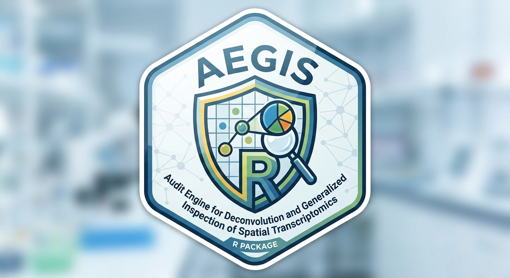
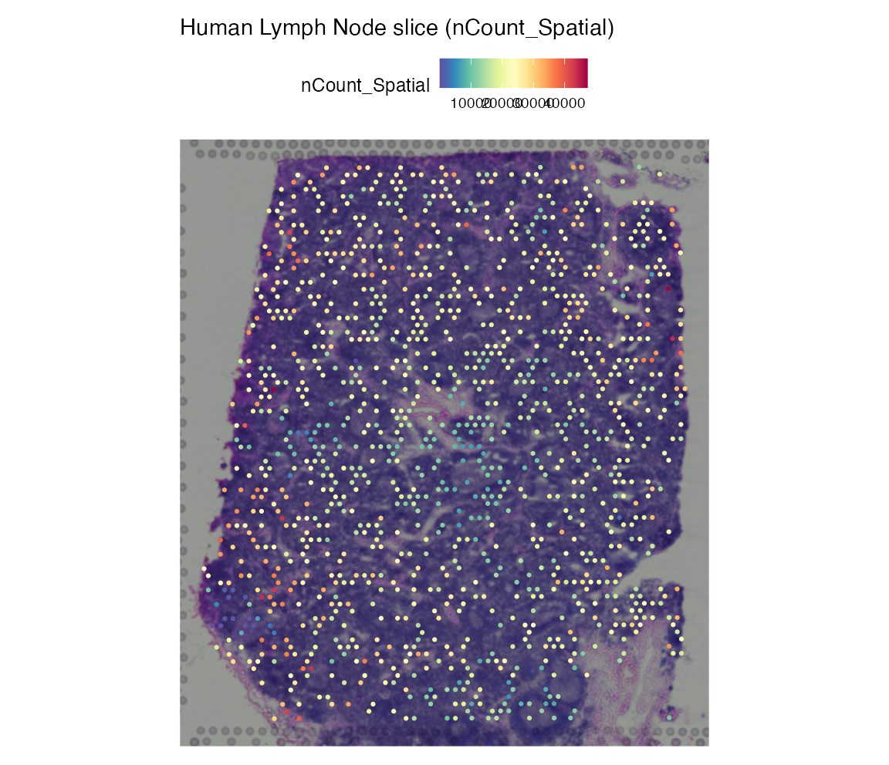
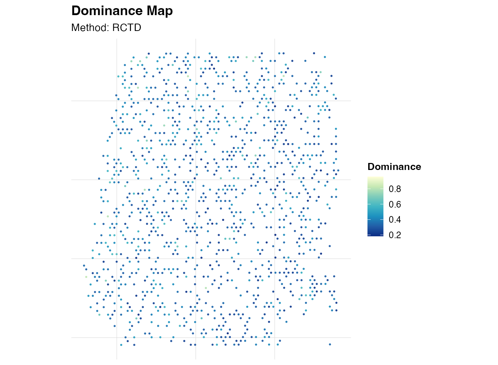

<p align="center">
  
</p>

# AEGIS

**AEGIS**: **A**udit and **E**valuate deconvolution outputs in **G**rid-based Spatial transcriptomics.

[](https://github.com/JamesWu7/AEGIS/actions/workflows/R-CMD-check.yaml)
[](https://github.com/JamesWu7/AEGIS/actions/workflows/pkgdown.yaml)

AEGIS is an R package for basic auditing of spatial deconvolution outputs on Seurat spatial objects, with a minimal and reproducible Human Lymph Node workflow.

## Installation

```r
install.packages("devtools")
devtools::install_github("JamesWu7/AEGIS")
```

## Quick Start

```r
library(AEGIS)

seu <- load_10x_lymphnode()
deconv <- simulate_deconv_results(seu)
markers <- readRDS(system.file("extdata", "marker_list.rds", package = "AEGIS"))
obj <- as_aegis(seu, deconv, markers = markers)
obj <- audit_basic(obj)
obj <- audit_marker(obj)
obj <- audit_spatial(obj)
obj <- compare_methods(obj)
obj <- compute_consensus(obj)
```

## Import Real Deconvolution Results

AEGIS imports exported result tables from external methods. It does **not** install or run RCTD/SPOTlight/cell2location backends.

```r
seu <- load_10x_lymphnode()

rctd <- read_rctd("path/to/rctd_output.csv")
spotlight <- read_spotlight("path/to/spotlight_output.tsv")
cell2location <- read_cell2location("path/to/cell2location_output.csv")

obj <- as_aegis(
  seu,
  deconv = list(
    RCTD = rctd,
    SPOTlight = spotlight,
    cell2location = cell2location
  )
)
```

For cell2location, export posterior abundance/proportion tables to csv/tsv/txt first, then import with `read_cell2location()`.

## Complete Tutorials

- [Overview tutorial](https://jameswu7.github.io/AEGIS/articles/AEGIS-overview.html)
- [Human lymph node demo](https://jameswu7.github.io/AEGIS/articles/AEGIS-demo-human-lymph-node.html)
- [Complete tutorial](https://jameswu7.github.io/AEGIS/articles/AEGIS-complete-tutorial.html)

## Key Functions

- `load_10x_lymphnode()`: load the Human Lymph Node 10x spatial dataset into a Seurat object.
- `simulate_deconv_results()`: generate realistic mock method outputs (spot-by-celltype proportions).
- `as_aegis()`: validate inputs and create the internal `aegis` S3 object.
- `audit_basic()`: compute per-spot and per-method basic quality metrics.
- `audit_marker()`: quantify marker-expression support and method concordance.
- `audit_spatial()`: compute neighborhood-based local inconsistency metrics.
- `compare_methods()`: summarize cross-method agreement by cell type and spot.
- `compute_consensus()`: aggregate shared cell types and derive confidence/stability.

## Example Figures

### Spatial transcriptomics slice (Human Lymph Node)



### Basic audit (dominance)



## Citation

```r
citation("AEGIS")
```

BibTeX:

```bibtex
@Manual{Wu2026AEGIS,
  title = {AEGIS: Audit and Evaluate Deconvolution Outputs in Grid-Based Spatial Transcriptomics},
  author = {Xinjie Wu},
  year = {2026},
  note = {R package version 0.1.0},
  url = {https://github.com/JamesWu7/AEGIS}
}
```
