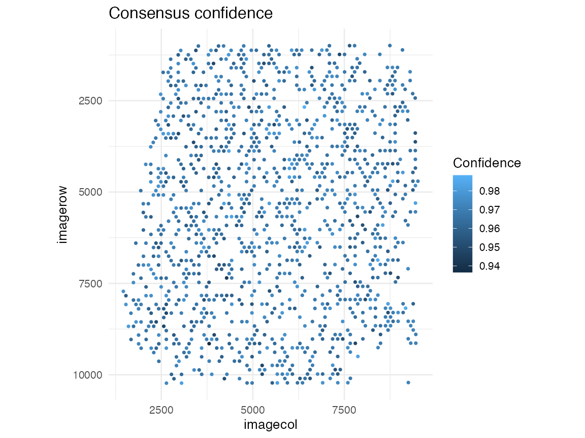

<p align="center">
  
</p>

# AEGIS

AEGIS is an R package MVP for auditing, comparing, and summarizing spatial deconvolution outputs on Seurat spatial objects, with an end-to-end Human Lymph Node workflow and HTML reporting.

Repository: [JamesWu7/AEGIS](https://github.com/JamesWu7/AEGIS)

## Installation

### Install from GitHub with devtools

```r
install.packages("devtools")
devtools::install_github("JamesWu7/AEGIS")
```

### Dependencies

Dependencies are declared in `DESCRIPTION` (`Seurat`, `ggplot2`, `dplyr`, `tidyr`, `Matrix`, `rmarkdown`, `patchwork`, `stats`, `utils`) and are handled by package installation.

### Current MVP scope

This phase includes simulated deconvolution matrices (`RCTD`, `SPOTlight`, `cell2location`) for development and demos. Real backend integrations are intentionally out of scope for this MVP.

## Quick Start

```r
library(AEGIS)

seu <- load_10x_lymphnode(data_dir = ".")
deconv <- simulate_deconv_results(seu)
markers <- readRDS(system.file("extdata", "marker_list.rds", package = "AEGIS"))

obj <- as_aegis(seu, deconv, markers = markers)
obj <- audit_basic(obj)
obj <- audit_marker(obj)
obj <- audit_spatial(obj)
obj <- compare_methods(obj)
obj <- compute_consensus(obj)

plot_audit(obj, "dominance")
plot_compare(obj, "heatmap")
```

## Workflow Overview

1. Load 10x Human Lymph Node spatial data into a Seurat object with `load_10x_lymphnode()`.
2. Generate reproducible mock deconvolution outputs with `simulate_deconv_results()`.
3. Construct analysis state with `as_aegis()`.
4. Run audits: `audit_basic()`, `audit_marker()`, and `audit_spatial()`.
5. Compare methods and compute consensus with `compare_methods()` and `compute_consensus()`.
6. Visualize with `plot_audit()` and `plot_compare()`.
7. Render a standalone report with `render_report()`.

## Example Figures

### Spatial transcriptomics slice (Human Lymph Node)


### Spatial audit (dominance)


### Method comparison (agreement heatmap)


### Consensus confidence



## Data and Asset Locations

- Example Seurat object: `data/aegis_example.rda`
- Marker list: `inst/extdata/marker_list.rds`
- Metrics summary: `inst/extdata/V1_Human_Lymph_Node_metrics_summary.csv`
- Package logo: `inst/assets/AEGIS_Logo.jpg`
- README/demo figures: `inst/assets/figures/`

## Complete Tutorials

- `vignettes/AEGIS-overview.Rmd`
- `vignettes/AEGIS-demo-human-lymph-node.Rmd`
- `vignettes/AEGIS-complete-tutorial.Rmd`

## Citation (Manuscript-ready)

Use the following text directly in a manuscript:

> Wu X (2026). *AEGIS: Audit and Evaluate deconvolution outputs in Grid-based Spatial transcriptomics*. R package version 0.1.0. GitHub: https://github.com/JamesWu7/AEGIS

BibTeX:

```bibtex
@Manual{Wu2026AEGIS,
  title = {AEGIS: Audit and Evaluate deconvolution outputs in Grid-based Spatial transcriptomics},
  author = {Xinjie Wu},
  year = {2026},
  note = {R package version 0.1.0},
  url = {https://github.com/JamesWu7/AEGIS}
}
```

In R:

```r
citation("AEGIS")
```

## Demo and Report Generation

Use built example data (created from the Human Lymph Node dataset):

```r
library(AEGIS)
data("aegis_example", package = "AEGIS")
markers <- readRDS(system.file("extdata", "marker_list.rds", package = "AEGIS"))

deconv <- simulate_deconv_results(aegis_example, seed = 1)
obj <- as_aegis(aegis_example, deconv, markers = markers)
obj <- audit_basic(obj)
obj <- audit_marker(obj)
obj <- audit_spatial(obj)
obj <- compare_methods(obj)
obj <- compute_consensus(obj)

render_report(obj, output_file = "aegis_demo_report.html")
```
