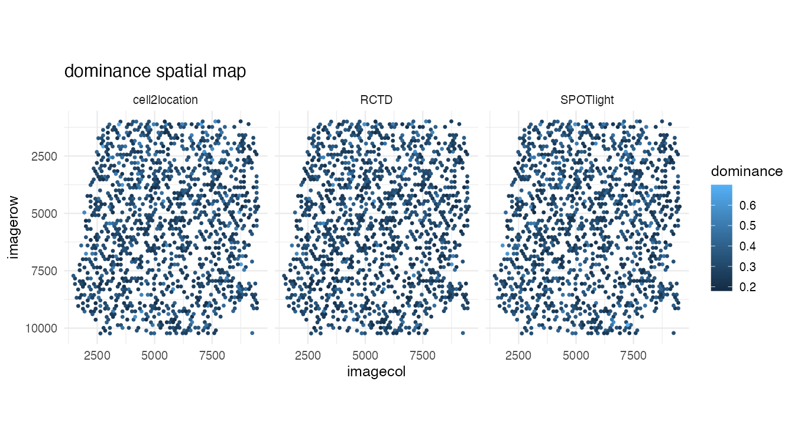
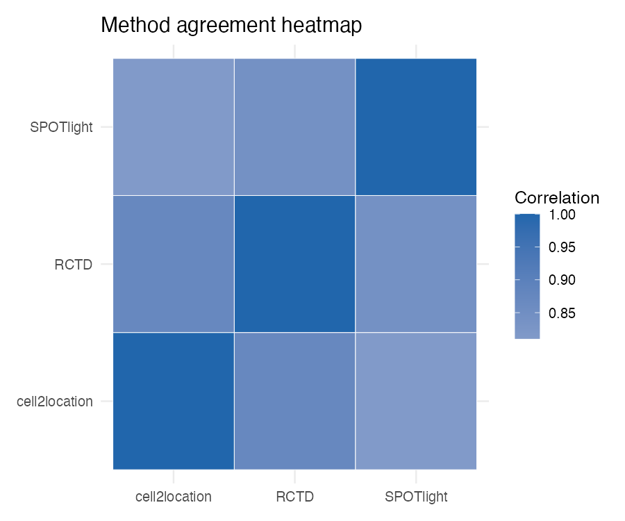
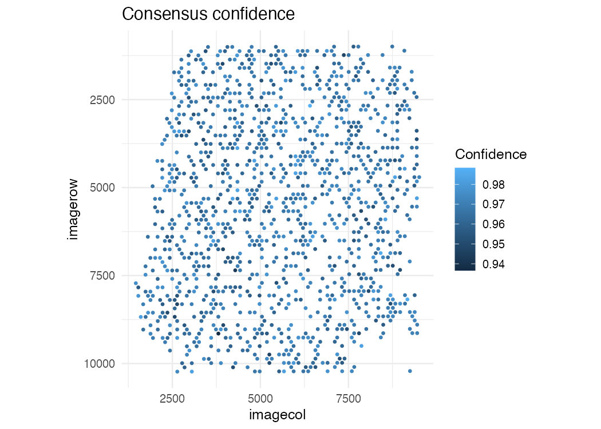

<p align="left">
  
</p>

# AEGIS

AEGIS is an R package MVP for auditing, comparing, and summarizing spatial deconvolution outputs on Seurat spatial objects, with an end-to-end Human Lymph Node workflow and HTML reporting.

## Installation

### Core install

```r
# from local source
install.packages(".", repos = NULL, type = "source")

# or with remotes/devtools if preferred
# remotes::install_local(".")
```

### Dependencies

Dependencies are declared in `DESCRIPTION` (`Seurat`, `ggplot2`, `dplyr`, `tidyr`, `Matrix`, `rmarkdown`, `patchwork`, `stats`, `utils`) and are handled by normal R package installation.

### Current MVP scope

This phase includes simulated deconvolution matrices (`RCTD`, `SPOTlight`, `cell2location`) for development and demos. Real backend integrations are intentionally out of scope for this MVP.

## Quick Start

```r
library(AEGIS)

seu <- load_10x_lymphnode(data_dir = ".")
deconv <- simulate_deconv_results(seu)
markers <- readRDS(system.file("extdata", "marker_list.rds", package = "AEGIS"))

obj <- as_aegis(seu, deconv, markers = markers)
obj <- audit_basic(obj)
obj <- audit_marker(obj)
obj <- audit_spatial(obj)
obj <- compare_methods(obj)
obj <- compute_consensus(obj)

plot_audit(obj, "dominance")
plot_compare(obj, "heatmap")
```

## Workflow Overview

1. Load 10x Human Lymph Node spatial data into a Seurat object with `load_10x_lymphnode()`.
2. Generate reproducible mock deconvolution outputs with `simulate_deconv_results()`.
3. Construct analysis state with `as_aegis()`.
4. Run audits: `audit_basic()`, `audit_marker()`, and `audit_spatial()`.
5. Compare methods and compute consensus with `compare_methods()` and `compute_consensus()`.
6. Visualize with `plot_audit()` and `plot_compare()`.
7. Render a standalone report with `render_report()`.

## Example Figures

### Spatial audit (dominance)



### Method comparison (agreement heatmap)



### Consensus confidence



## Key Functions

- `load_10x_lymphnode()`: robust loader from current authoritative raw files
- `simulate_deconv_results()`: method-specific simulated deconvolution outputs
- `as_aegis()`: validated S3 object constructor
- `audit_basic()`, `audit_marker()`, `audit_spatial()`: audit suite
- `compare_methods()`, `compute_consensus()`: agreement and consensus
- `plot_audit()`, `plot_compare()`: publication-friendly figures
- `render_report()`: standalone HTML report from template

## Demo and Report Generation

Use built example data (created from the Human Lymph Node dataset):

```r
library(AEGIS)
data("aegis_example", package = "AEGIS")
markers <- readRDS(system.file("extdata", "marker_list.rds", package = "AEGIS"))

deconv <- simulate_deconv_results(aegis_example, seed = 1)
obj <- as_aegis(aegis_example, deconv, markers = markers)
obj <- audit_basic(obj)
obj <- audit_marker(obj)
obj <- audit_spatial(obj)
obj <- compare_methods(obj)
obj <- compute_consensus(obj)

render_report(obj, output_file = "aegis_demo_report.html")
```
