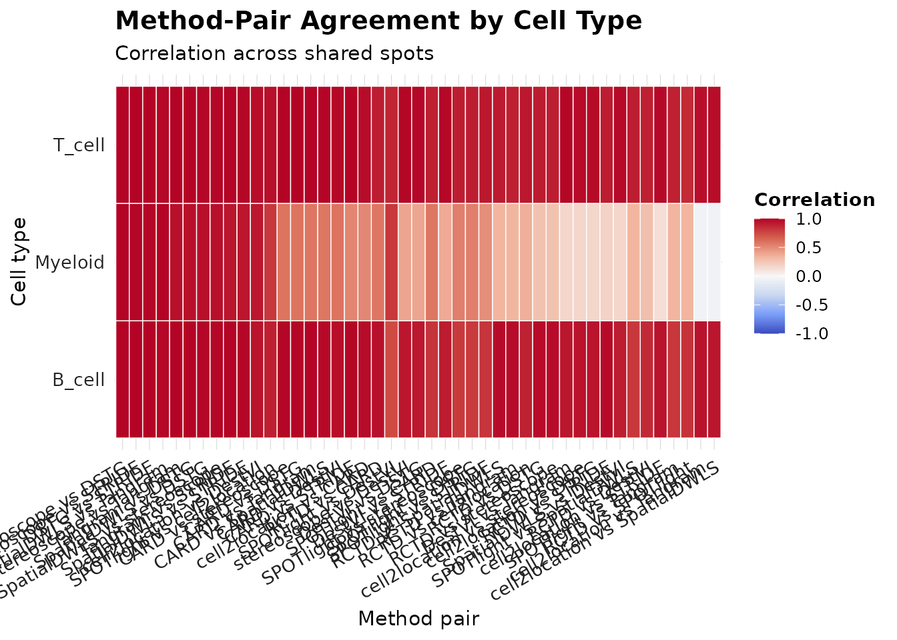
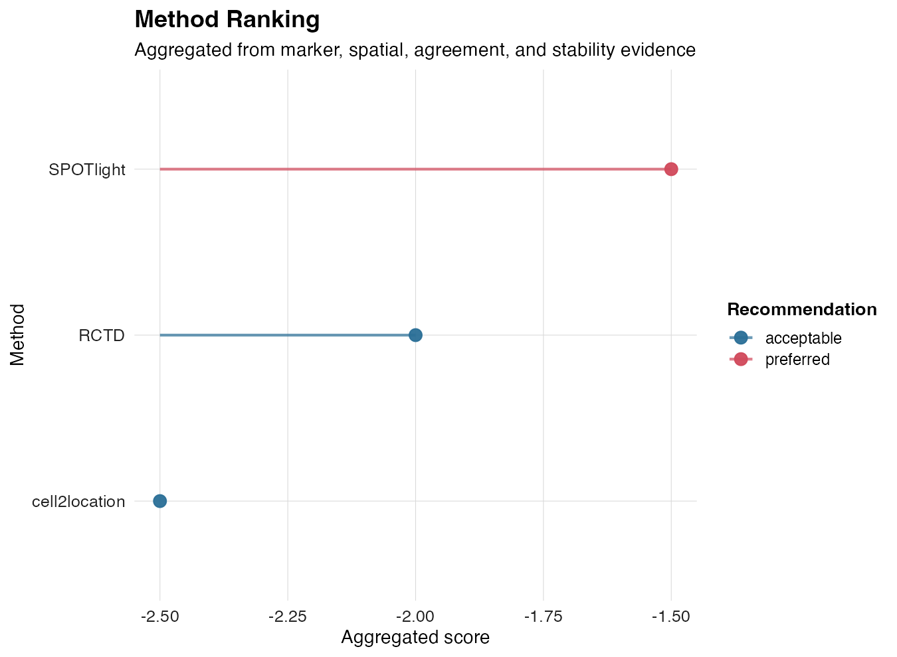
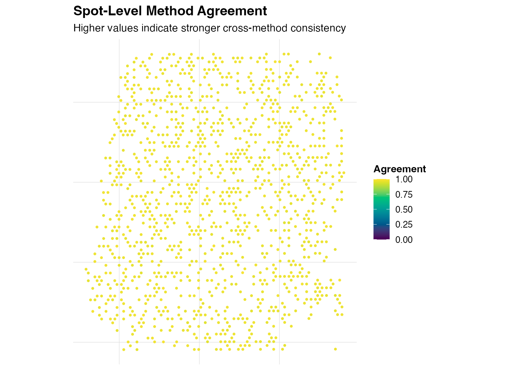
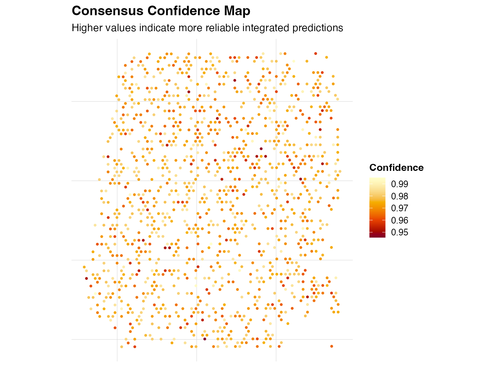

<p align="center">
  
</p>

# AEGIS

**AEGIS**: **A**udit and **E**valuate deconvolution outputs in **G**rid-based Spatial transcriptomics.

[](https://github.com/JamesWu7/AEGIS/actions/workflows/R-CMD-check.yaml)
[](https://github.com/JamesWu7/AEGIS/actions/workflows/pkgdown.yaml)

AEGIS is an R package for basic auditing of spatial deconvolution outputs on Seurat spatial objects, with a minimal and reproducible Human Lymph Node workflow.

## Installation

```r
install.packages("devtools")
devtools::install_github("JamesWu7/AEGIS")
```

## Workflow at a Glance

AEGIS now supports three primary workflows:

1. Simulated method outputs for development and demos (`simulate_deconv_results()`).
2. Real exported outputs from external methods through adapter readers (e.g. `read_rctd()`, `read_spotlight()`, `read_cell2location()`, `read_card()`, `read_destvi()`, `read_stdeconvolve()`), plus `read_deconv_table()` for generic spot-by-celltype tables.
3. One-shot deconvolution orchestration for directly runnable methods (`run_deconvolution()`, `run_aegis_full()`), with explicit run-vs-import capability metadata from `get_supported_methods()`.

For day-to-day use, the recommended minimal API is:

1. `load_10x_lymphnode()` or `load_10x_spatial_set()`
2. `run_aegis()`
3. `score_methods()` -> `rank_methods()` -> `compute_consensus(strategy = "weighted")`
4. `plot_method_ranking()` / `plot_disagreement_map()` / `plot_consensus_confidence()` / `render_report()`

## One-shot Deconvolution (P9)

AEGIS now provides a unified orchestration layer that can run selected methods when their runtime dependencies are available, and then hand off standardized outputs into downstream AEGIS analysis.

```r
seu <- load_10x_lymphnode()

res <- run_deconvolution(
  seu = seu,
  reference = ref,
  methods = c("SPOTlight", "RCTD", "CARD"),
  strict = FALSE
)

obj <- run_aegis(res$seu, deconv = res$deconv, markers = markers)
```

or one-shot end to end:

```r
obj <- run_aegis_full(
  seu = seu,
  reference = ref,
  methods = c("SPOTlight", "RCTD", "CARD"),
  markers = markers,
  strict = FALSE
)
```

Use `get_supported_methods()` to inspect exact support mode (`run_and_import_r`, `run_and_import_python`, `import_only`) before execution.

## Quick Start (Simulated)

```r
library(AEGIS)

seu <- load_10x_lymphnode()
deconv <- simulate_deconv_results(seu)
markers <- readRDS(system.file("extdata", "marker_list.rds", package = "AEGIS"))
obj <- run_aegis(seu, deconv = deconv, markers = markers)
obj <- score_methods(obj)
obj <- rank_methods(obj, method = "rra")
obj <- compute_consensus(obj, strategy = "weighted")

p_rank <- plot_method_ranking(obj)
p_dis <- plot_disagreement_map(obj)
p_conf <- plot_consensus_confidence(obj)
```

## Import Real Deconvolution Results (P8)

AEGIS imports exported result tables from external methods. It does **not** install or run external backends.
For Python/deep-learning methods, export spot-by-celltype tables first, then import into AEGIS.

```r
seu <- load_10x_lymphnode()

rctd <- read_rctd("path/to/rctd_output.csv")
spotlight <- read_spotlight("path/to/spotlight_output.tsv")
cell2location <- read_cell2location("path/to/cell2location_output.csv")

obj <- as_aegis(
  seu,
  deconv = list(
    RCTD = rctd,
    SPOTlight = spotlight,
    cell2location = cell2location
  )
)

obj <- audit_basic(obj)
obj <- compare_methods(obj)
obj <- compute_consensus(obj)
```

For cell2location, export posterior abundance/proportion tables to csv/tsv/txt first, then import with `read_cell2location()`.

### Method Support Matrix

| Method | Support mode | Run in R | Run via Python | Import exported results | Notes |
|---|---|---|---|---|---|
| RCTD | `run_and_import_r` | Yes (`run_rctd`) | No | Yes (`read_rctd`) | Direct run requires `spacexr` |
| SPOTlight | `run_and_import_r` | Yes (`run_spotlight`) | No | Yes (`read_spotlight`) | Direct run requires `SPOTlight` |
| CARD | `run_and_import_r` | Yes (`run_card`) | No | Yes (`read_card`) | Direct run requires `CARD` |
| cell2location | `run_and_import_python` | No | Optional (`run_cell2location`) | Yes (`read_cell2location`) | Python/reticulate environment required |
| stereoscope | `run_and_import_python` | No | Optional (`run_stereoscope`) | Yes (`read_stereoscope`) | Python/reticulate environment required |
| DestVI | `run_and_import_python` | No | Optional (`run_destvi`) | Yes (`read_destvi`) | Python/reticulate environment required |
| Tangram | `run_and_import_python` | No | Optional (`run_tangram`) | Yes (`read_tangram`) | Mapping-style composition input |
| SpatialDWLS | `import_only` | No | No | Yes (`read_spatialdwls`) | Table adapter |
| STdeconvolve | `import_only` | No | No | Yes (`read_stdeconvolve`) | Latent labels allowed |
| DSTG | `import_only` | No | No | Yes (`read_dstg`) | Table adapter |
| STRIDE | `import_only` | No | No | Yes (`read_stride`) | Topic-only strict checks supported |

### Additional Import Examples

```r
card <- read_card("path/to/card.csv")
destvi <- read_destvi("path/to/destvi.csv")
stdec <- read_stdeconvolve("path/to/stdeconvolve.csv")

obj <- as_aegis(
  seu,
  deconv = list(
    CARD = card,
    DestVI = destvi,
    STdeconvolve = stdec
  )
)
```

## Multi-sample Workflow (P6)

```r
seu_list <- load_10x_spatial_set(
  paths = c("sample1_dir", "sample2_dir"),
  sample_ids = c("sample1", "sample2")
)

deconv_nested <- list(
  sample1 = list(RCTD = rctd1, SPOTlight = spotlight1),
  sample2 = list(RCTD = rctd2, SPOTlight = spotlight2)
)

obj_multi <- run_aegis(seu_list, deconv = deconv_nested, markers = markers)

summary_tbl <- summarize_by_sample(obj_multi)
render_report_batch(obj_multi, output_dir = "reports")
```

## Tutorials

If GitHub Pages is temporarily unavailable, use the preview fallback links or the source `.Rmd` links below.

- [Quick Start tutorial](https://htmlpreview.github.io/?https://github.com/JamesWu7/AEGIS/blob/main/docs/articles/AEGIS-overview.html) (includes `plot_compare` visualizations and RRA/mean-rank selection) ([pkgdown page](https://jameswu7.github.io/AEGIS/articles/AEGIS-overview.html), [source](vignettes/AEGIS-overview.Rmd))
- [Real Data tutorial (Human Lymph Node)](https://htmlpreview.github.io/?https://github.com/JamesWu7/AEGIS/blob/main/docs/articles/AEGIS-complete-tutorial.html) (includes all supported import adapters, method comparison, best-method selection, weighted consensus) ([pkgdown page](https://jameswu7.github.io/AEGIS/articles/AEGIS-complete-tutorial.html), [source](vignettes/AEGIS-complete-tutorial.Rmd))

## Key Functions

- `load_10x_lymphnode()`: load the Human Lymph Node 10x spatial dataset into a Seurat object.
- `simulate_deconv_results()`: generate realistic mock method outputs (spot-by-celltype proportions).
- `read_rctd()`: import exported RCTD result tables/RDS and standardize to spot-by-celltype.
- `read_spotlight()`: import exported SPOTlight result tables/RDS and standardize to spot-by-celltype.
- `read_cell2location()`: import exported cell2location tables/RDS (abundance or proportion) and standardize.
- `read_card()`, `read_spatialdwls()`, `read_stereoscope()`, `read_destvi()`, `read_tangram()`, `read_stdeconvolve()`, `read_dstg()`, `read_stride()`: method-specific import adapters.
- `read_deconv_table()`: generic importer for spot-by-celltype exported tables.
- `get_supported_methods()`: inspect method capability registry and support modes.
- `run_deconvolution()`: unified deconvolution orchestrator across runnable/import-only methods.
- `run_aegis_full()`: one-shot wrapper from deconvolution dispatch to full AEGIS downstream analysis.
- `run_spotlight()`, `run_card()`, `run_rctd()`: R-native runner wrappers (dependency-aware).
- `run_cell2location()`, `run_destvi()`, `run_tangram()`, `run_stereoscope()`: optional Python-backed runner wrappers via `reticulate`.
- `as_aegis()`: validate inputs and create the internal `aegis` S3 object.
- `audit_basic()`: compute per-spot and per-method basic quality metrics.
- `audit_marker()`: quantify marker-expression support and method concordance.
- `audit_spatial()`: compute neighborhood-based local inconsistency metrics.
- `compare_methods()`: summarize cross-method agreement by cell type and spot.
- `score_methods()`: score methods from marker/spatial/agreement/stability evidence.
- `rank_methods()`: aggregate evidence into robust method rankings (`rra` or `mean_rank`).
- `compute_consensus()`: integrate methods with `mean` / `weighted` / `trimmed_mean` strategies and return disagreement/confidence.
- `plot_method_ranking()`: ggplot ranking summary from strongest to weakest methods.
- `plot_disagreement_map()`: tissue-context map of spot-level cross-method disagreement.
- `plot_consensus_confidence()`: tissue-context map of spot-level consensus confidence.
- `run_aegis()`: one-call pipeline for single-sample or multi-sample workflows.

## Example Figures

### Spatial transcriptomics slice (Human Lymph Node)


### Basic audit (dominance)


### Cross-method agreement heatmap



### Method ranking



### Spot-level agreement



### Consensus confidence



## Citation

```r
citation("AEGIS")
```

BibTeX:

```bibtex
@Manual{Wu2026AEGIS,
  title = {AEGIS: Audit and Evaluate Deconvolution Outputs in Grid-Based Spatial Transcriptomics},
  author = {Xinjie Wu},
  year = {2026},
  note = {R package version 0.1.0},
  url = {https://github.com/JamesWu7/AEGIS}
}
```
