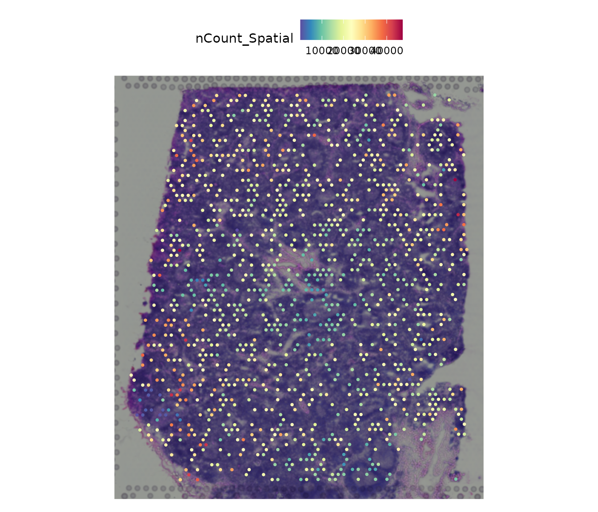

# AEGIS Demo Human Lymph Node

## Demo data source

This vignette uses the built-in Human Lymph Node example object
(`aegis_example`) so it can render in CI, pkgdown, and source builds.

``` r
data("aegis_example", package = "AEGIS")
seu <- aegis_example
seu
#> An object of class Seurat 
#> 36601 features across 1200 samples within 1 assay 
#> Active assay: Spatial (36601 features, 0 variable features)
#>  2 layers present: counts, data
#>  1 spatial field of view present: slice1
```

## Optional: load directly from authoritative raw files

If you are in the repository root and have these raw files available:

- `V1_Human_Lymph_Node_filtered_feature_bc_matrix.h5`
- `V1_Human_Lymph_Node_spatial.tar.gz`
- `V1_Human_Lymph_Node_metrics_summary.csv`

then you can load from disk with:

``` r
seu <- load_10x_lymphnode(data_dir = ".")
```

## Spatial transcriptomics slice example

``` r
Seurat::SpatialFeaturePlot(seu, features = "nCount_Spatial")
```



## Simulate deconvolution and run AEGIS

``` r
deconv <- simulate_deconv_results(seu, seed = 2026)
obj <- as_aegis(seu, deconv)
obj <- audit_basic(obj)
```

## Basic audit output

``` r
knitr::kable(obj$audit$basic$summary)
```

| method        | n_spots | n_celltypes | zero_fraction | near_zero_fraction | mean_dominance | mean_entropy | mean_n_detected_types | mean_sum_dev |
|:--------------|--------:|------------:|--------------:|-------------------:|---------------:|-------------:|----------------------:|-------------:|
| RCTD          |    1200 |           7 |     0.1015476 |          0.2575000 |      0.3695554 |     1.557445 |              5.197500 |            0 |
| SPOTlight     |    1200 |           7 |     0.0410714 |          0.1664286 |      0.3073309 |     1.702981 |              5.835000 |            0 |
| cell2location |    1200 |           7 |     0.0896429 |          0.2244048 |      0.3407826 |     1.617544 |              5.429167 |            0 |
