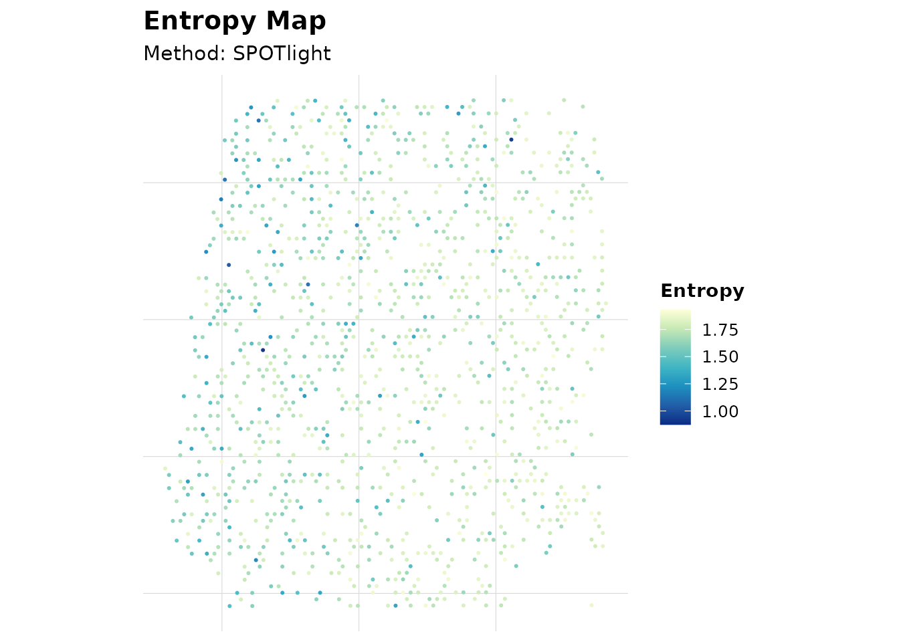

# AEGIS Complete Tutorial

## 1. Load Example Seurat Object

``` r
data("aegis_example", package = "AEGIS")
seu <- aegis_example
```

## 2. Simulated Workflow (Development Path)

``` r
markers <- readRDS(system.file("extdata", "marker_list.rds", package = "AEGIS"))
deconv_sim <- simulate_deconv_results(
  seu,
  methods = c("RCTD", "SPOTlight", "cell2location"),
  seed = 2026
)
#> Loading required namespace: SeuratObject

obj_sim <- run_aegis(seu, deconv = deconv_sim, markers = markers)
```

``` r
knitr::kable(obj_sim$audit$basic$summary)
```

| method        | n_spots | n_celltypes | zero_fraction | near_zero_fraction | mean_dominance | mean_entropy | mean_n_detected_types | mean_sum_dev |
|:--------------|--------:|------------:|--------------:|-------------------:|---------------:|-------------:|----------------------:|-------------:|
| RCTD          |    1200 |           7 |     0.1015476 |          0.2575000 |      0.3695554 |     1.557445 |              5.197500 |            0 |
| SPOTlight     |    1200 |           7 |     0.0410714 |          0.1664286 |      0.3073309 |     1.702981 |              5.835000 |            0 |
| cell2location |    1200 |           7 |     0.0896429 |          0.2244048 |      0.3407826 |     1.617544 |              5.429167 |            0 |

``` r
plot_audit(obj_sim, type = "entropy", method = "SPOTlight")
```



## 3. Real Import Workflow (P5 Path)

This section mimics exported backend result files and imports them using
the new readers.

``` r
spots <- colnames(seu)[1:8]
seu_small <- suppressWarnings(seu[, spots])
```

### 3.1 Build Example Exported Files

``` r
tmp_rctd <- tempfile(fileext = ".csv")
utils::write.csv(
  data.frame(
    barcode = spots,
    B_cell = c(0.5, 0.2, 0.4, 0.3, 0.1, 0.2, 0.4, 0.5),
    T_cell = c(0.3, 0.6, 0.4, 0.4, 0.7, 0.6, 0.3, 0.3),
    Myeloid = c(0.2, 0.2, 0.2, 0.3, 0.2, 0.2, 0.3, 0.2),
    check.names = FALSE
  ),
  tmp_rctd,
  row.names = FALSE
)

tmp_spotlight <- tempfile(fileext = ".tsv")
utils::write.table(
  data.frame(
    spot_id = spots,
    B_cell = c(0.4, 0.3, 0.5, 0.3, 0.2, 0.3, 0.4, 0.4),
    T_cell = c(0.4, 0.5, 0.3, 0.4, 0.6, 0.5, 0.4, 0.3),
    Myeloid = c(0.2, 0.2, 0.2, 0.3, 0.2, 0.2, 0.2, 0.3),
    sample = "S1",
    check.names = FALSE
  ),
  tmp_spotlight,
  sep = "\t",
  quote = FALSE,
  row.names = FALSE
)

tmp_cell2location <- tempfile(fileext = ".csv")
utils::write.csv(
  data.frame(
    spot = spots,
    B_cell = c(15, 8, 12, 10, 5, 7, 9, 11),
    T_cell = c(12, 18, 10, 13, 20, 16, 12, 10),
    Myeloid = c(5, 6, 4, 8, 5, 7, 6, 9),
    x = seq_along(spots),
    y = rev(seq_along(spots)),
    check.names = FALSE
  ),
  tmp_cell2location,
  row.names = FALSE
)
```

### 3.2 Import and Standardize

``` r
rctd <- read_rctd(tmp_rctd)
spotlight <- read_spotlight(tmp_spotlight)
cell2location <- read_cell2location(tmp_cell2location)
#> Warning: cell2location: dropped likely metadata numeric columns: x, y
```

### 3.3 Build AEGIS Object from Real Inputs

``` r
obj_real <- run_aegis(
  seu_small,
  deconv = list(
    RCTD = rctd,
    SPOTlight = spotlight,
    cell2location = cell2location
  ),
  do_marker = FALSE,
  do_spatial = FALSE
)
```

``` r
knitr::kable(obj_real$audit$basic$summary)
```

| method        | n_spots | n_celltypes | zero_fraction | near_zero_fraction | mean_dominance | mean_entropy | mean_n_detected_types | mean_sum_dev |
|:--------------|--------:|------------:|--------------:|-------------------:|---------------:|-------------:|----------------------:|-------------:|
| RCTD          |       8 |           3 |             0 |                  0 |      0.5125000 |    0.9992982 |                     3 |            0 |
| SPOTlight     |       8 |           3 |             0 |                  0 |      0.4625000 |    1.0408587 |                     3 |            0 |
| cell2location |       8 |           3 |             0 |                  0 |      0.4904068 |    1.0158112 |                     3 |            0 |

## 4. Multi-sample Workflow (P6)

``` r
spots_all <- colnames(seu)
n_half <- floor(length(spots_all) / 2)

seu_list <- list(
  sample1 = suppressWarnings(seu[, spots_all[seq_len(n_half)]]),
  sample2 = suppressWarnings(seu[, spots_all[seq.int(n_half + 1L, length(spots_all))]])
)

deconv_nested <- list(
  sample1 = simulate_deconv_results(seu_list$sample1, methods = c("RCTD", "SPOTlight"), seed = 333),
  sample2 = simulate_deconv_results(seu_list$sample2, methods = c("RCTD", "SPOTlight"), seed = 444)
)

obj_multi <- run_aegis(
  seu_list,
  deconv = deconv_nested,
  markers = markers
)

sample_summary <- summarize_by_sample(obj_multi)
knitr::kable(sample_summary)
```

| sample_id | n_spots | method    | methods_available | mean_dominance | mean_entropy | mean_local_inconsistency | mean_spot_agreement | mean_consensus_confidence |
|:----------|--------:|:----------|:------------------|---------------:|-------------:|-------------------------:|--------------------:|--------------------------:|
| sample1   |     600 | RCTD      | RCTD;SPOTlight    |      0.3709512 |     1.553806 |                0.0951720 |           0.9736282 |                 0.9631498 |
| sample1   |     600 | SPOTlight | RCTD;SPOTlight    |      0.3076496 |     1.707738 |                0.0726369 |           0.9736282 |                 0.9631498 |
| sample2   |     600 | RCTD      | RCTD;SPOTlight    |      0.3767248 |     1.546486 |                0.0933078 |           0.9737247 |                 0.9632824 |
| sample2   |     600 | SPOTlight | RCTD;SPOTlight    |      0.3146903 |     1.688583 |                0.0737592 |           0.9737247 |                 0.9632824 |

``` r
render_report_batch(obj_multi, output_dir = "reports")
```

## 5. Optional Report Generation

``` r
render_report(obj_sim, output_file = "aegis_report.html")
```

## 6. Summary

- Use
  [`simulate_deconv_results()`](https://jameswu7.github.io/AEGIS/reference/simulate_deconv_results.md)
  for reproducible demos and method development.
- Use
  [`read_rctd()`](https://jameswu7.github.io/AEGIS/reference/read_rctd.md),
  [`read_spotlight()`](https://jameswu7.github.io/AEGIS/reference/read_spotlight.md),
  [`read_cell2location()`](https://jameswu7.github.io/AEGIS/reference/read_cell2location.md)
  for external exports.
- Use
  [`run_aegis()`](https://jameswu7.github.io/AEGIS/reference/run_aegis.md)
  as the unified pipeline entry for single-sample and multi-sample
  analysis.
- Use
  [`summarize_by_sample()`](https://jameswu7.github.io/AEGIS/reference/summarize_by_sample.md)
  and
  [`render_report_batch()`](https://jameswu7.github.io/AEGIS/reference/render_report_batch.md)
  for multi-sample projects.
