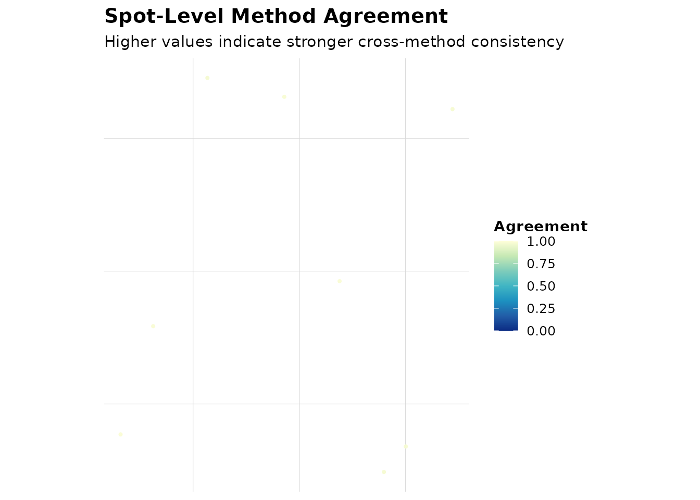
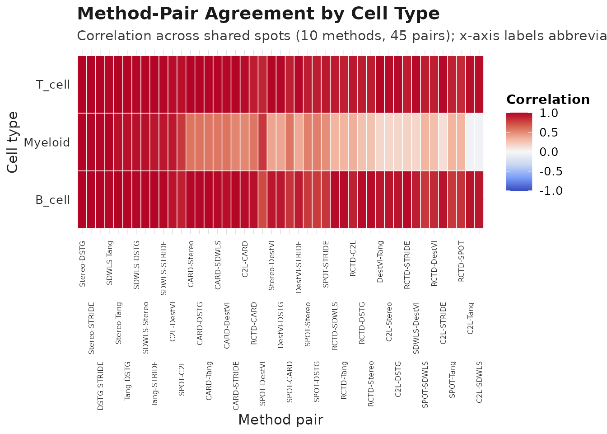
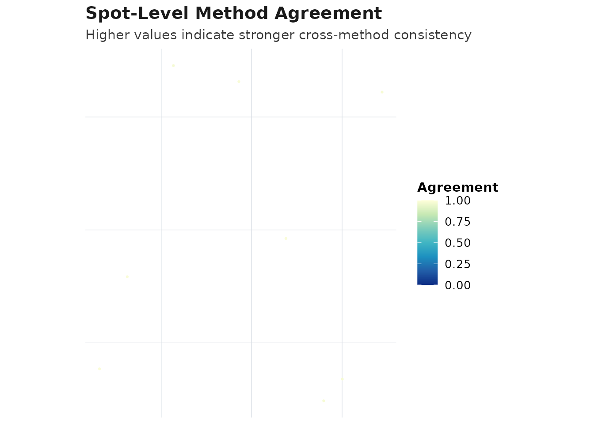
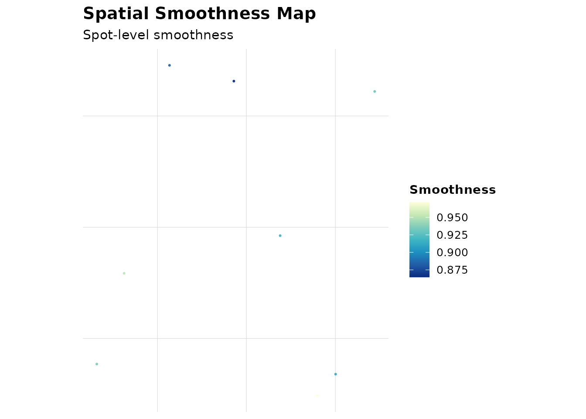
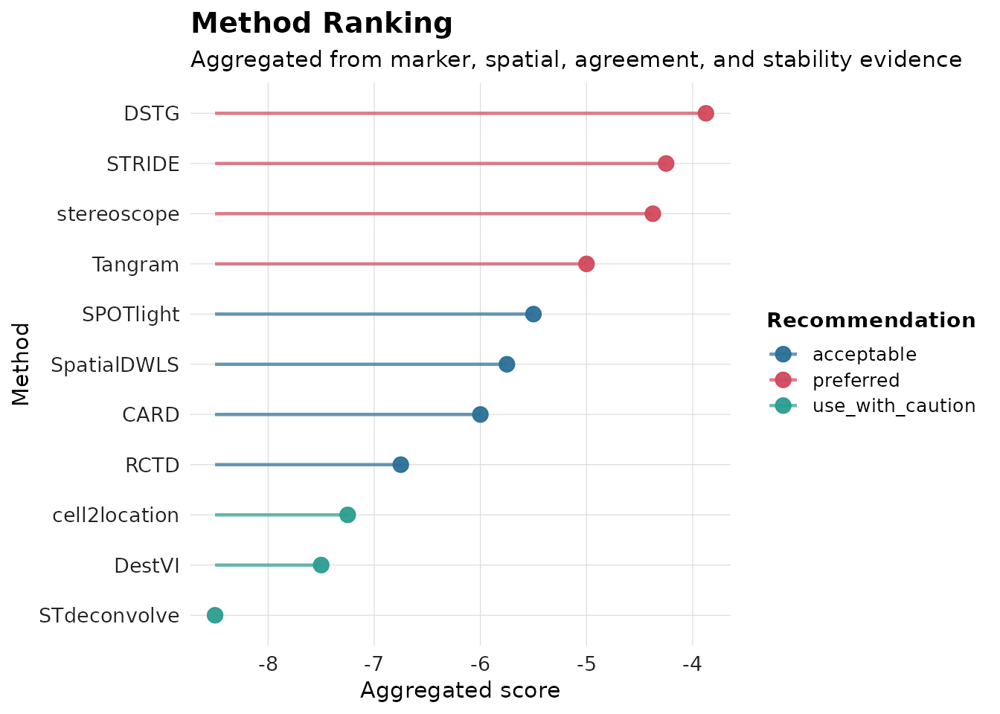
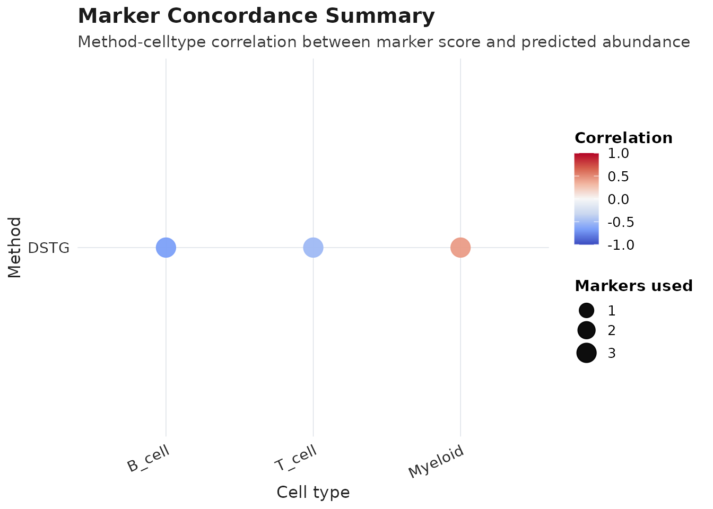

# AEGIS Deconvolution from Scratch + Downstream Analysis (Human Lymph Node)

**Updated workflow note:** this tutorial now centers on `get_supported_methods()`, `run_deconvolution()`, `run_aegis_full()`, and full downstream analysis (audit, ranking, consensus, visualization, report). If this rendered markdown lags, open the source `vignettes/AEGIS-complete-tutorial.Rmd`.

## Step 1. Load real Human Lymph Node data

If authoritative raw files are available in your repository root, load
directly:

``` r
seu <- load_10x_lymphnode(data_dir = ".")
```

For a fully reproducible tutorial run (including CI), use the built-in
object:

``` r
data("aegis_example", package = "AEGIS")
seu <- aegis_example
markers <- readRDS(system.file("extdata", "marker_list.rds", package = "AEGIS"))
```

## Step 2. Prepare exported result tables from multiple methods

``` r
spots <- colnames(seu)[1:8]
#> Loading required namespace: SeuratObject
seu_small <- suppressWarnings(seu[, spots])
#> Loading required namespace: Seurat

tmp_rctd <- tempfile(fileext = ".csv")
utils::write.csv(data.frame(
  barcode = spots,
  B_cell = c(0.50, 0.20, 0.40, 0.30, 0.10, 0.20, 0.40, 0.50),
  T_cell = c(0.30, 0.60, 0.40, 0.40, 0.70, 0.60, 0.30, 0.30),
  Myeloid = c(0.20, 0.20, 0.20, 0.30, 0.20, 0.20, 0.30, 0.20),
  check.names = FALSE
), tmp_rctd, row.names = FALSE)

tmp_spotlight <- tempfile(fileext = ".tsv")
utils::write.table(data.frame(
  spot_id = spots,
  B_cell = c(0.40, 0.30, 0.50, 0.30, 0.20, 0.30, 0.40, 0.40),
  T_cell = c(0.40, 0.50, 0.30, 0.40, 0.60, 0.50, 0.40, 0.30),
  Myeloid = c(0.20, 0.20, 0.20, 0.30, 0.20, 0.20, 0.20, 0.30),
  sample = "S1",
  check.names = FALSE
), tmp_spotlight, sep = "\t", quote = FALSE, row.names = FALSE)

tmp_cell2location <- tempfile(fileext = ".csv")
utils::write.csv(data.frame(
  spot = spots,
  B_cell = c(15, 8, 12, 10, 5, 7, 9, 11),
  T_cell = c(12, 18, 10, 13, 20, 16, 12, 10),
  Myeloid = c(5, 6, 4, 8, 5, 7, 6, 9),
  x = seq_along(spots),
  y = rev(seq_along(spots)),
  check.names = FALSE
), tmp_cell2location, row.names = FALSE)

tmp_card <- tempfile(fileext = ".csv")
utils::write.csv(data.frame(
  spot_id = spots,
  B_cell = c(0.55, 0.25, 0.45, 0.35, 0.15, 0.25, 0.35, 0.45),
  T_cell = c(0.30, 0.55, 0.35, 0.40, 0.65, 0.55, 0.45, 0.35),
  Myeloid = c(0.15, 0.20, 0.20, 0.25, 0.20, 0.20, 0.20, 0.20),
  check.names = FALSE
), tmp_card, row.names = FALSE)

tmp_spatialdwls <- tempfile(fileext = ".tsv")
utils::write.table(data.frame(
  barcode = spots,
  B_cell = c(0.50, 0.25, 0.40, 0.35, 0.10, 0.20, 0.35, 0.45),
  T_cell = c(0.30, 0.55, 0.35, 0.40, 0.70, 0.60, 0.45, 0.35),
  Myeloid = c(0.20, 0.20, 0.25, 0.25, 0.20, 0.20, 0.20, 0.20),
  sample = "S1",
  check.names = FALSE
), tmp_spatialdwls, sep = "\t", quote = FALSE, row.names = FALSE)

tmp_stereoscope <- tempfile(fileext = ".csv")
utils::write.csv(data.frame(
  spot_id = spots,
  B_cell = c(0.48, 0.22, 0.38, 0.32, 0.12, 0.22, 0.32, 0.42),
  T_cell = c(0.32, 0.58, 0.37, 0.43, 0.68, 0.58, 0.48, 0.36),
  Myeloid = c(0.20, 0.20, 0.25, 0.25, 0.20, 0.20, 0.20, 0.22),
  check.names = FALSE
), tmp_stereoscope, row.names = FALSE)

tmp_destvi <- tempfile(fileext = ".csv")
utils::write.csv(data.frame(
  barcode = spots,
  B_cell = c(20, 8, 12, 9, 5, 7, 8, 10),
  T_cell = c(10, 18, 11, 13, 20, 17, 12, 9),
  Myeloid = c(4, 6, 5, 7, 4, 6, 5, 8),
  check.names = FALSE
), tmp_destvi, row.names = FALSE)

tmp_tangram <- tempfile(fileext = ".tsv")
utils::write.table(data.frame(
  cell_id = spots,
  B_cell = c(0.52, 0.24, 0.42, 0.34, 0.14, 0.24, 0.34, 0.46),
  T_cell = c(0.28, 0.56, 0.34, 0.42, 0.66, 0.56, 0.46, 0.34),
  Myeloid = c(0.20, 0.20, 0.24, 0.24, 0.20, 0.20, 0.20, 0.20),
  check.names = FALSE
), tmp_tangram, sep = "\t", quote = FALSE, row.names = FALSE)

tmp_stdec <- tempfile(fileext = ".csv")
utils::write.csv(data.frame(
  spot = spots,
  topic1 = c(0.60, 0.30, 0.40, 0.50, 0.20, 0.30, 0.40, 0.50),
  topic2 = c(0.40, 0.70, 0.60, 0.50, 0.80, 0.70, 0.60, 0.50),
  check.names = FALSE
), tmp_stdec, row.names = FALSE)

tmp_dstg <- tempfile(fileext = ".csv")
utils::write.csv(data.frame(
  barcode = spots,
  B_cell = c(0.46, 0.21, 0.36, 0.31, 0.11, 0.21, 0.31, 0.40),
  T_cell = c(0.34, 0.59, 0.39, 0.44, 0.69, 0.59, 0.49, 0.38),
  Myeloid = c(0.20, 0.20, 0.25, 0.25, 0.20, 0.20, 0.20, 0.22),
  check.names = FALSE
), tmp_dstg, row.names = FALSE)

tmp_stride <- tempfile(fileext = ".csv")
utils::write.csv(data.frame(
  spot = spots,
  B_cell = c(0.47, 0.23, 0.39, 0.33, 0.13, 0.23, 0.33, 0.43),
  T_cell = c(0.33, 0.57, 0.36, 0.43, 0.67, 0.57, 0.47, 0.35),
  Myeloid = c(0.20, 0.20, 0.25, 0.24, 0.20, 0.20, 0.20, 0.22),
  confidence = c(0.90, 0.88, 0.87, 0.89, 0.91, 0.86, 0.88, 0.90),
  check.names = FALSE
), tmp_stride, row.names = FALSE)
```

## Step 3. Import all supported adapters

``` r
rctd <- read_rctd(tmp_rctd)
spotlight <- read_spotlight(tmp_spotlight)
cell2location <- read_cell2location(tmp_cell2location)
#> Warning: cell2location: dropped likely metadata numeric columns: x, y
card <- read_card(tmp_card)
spatialdwls <- read_spatialdwls(tmp_spatialdwls)
stereoscope <- read_stereoscope(tmp_stereoscope)
destvi <- read_destvi(tmp_destvi)
tangram <- read_tangram(tmp_tangram)
stdeconvolve <- read_stdeconvolve(tmp_stdec)
dstg <- read_dstg(tmp_dstg)
stride <- read_stride(tmp_stride)
#> Warning: STRIDE: dropped likely metadata numeric columns: confidence
generic <- read_deconv_table(tmp_stereoscope, method = "generic")

adapter_overview <- data.frame(
  method = c("RCTD", "SPOTlight", "cell2location", "CARD", "SpatialDWLS", "stereoscope", "DestVI", "Tangram", "STdeconvolve", "DSTG", "STRIDE", "generic"),
  n_spots = c(nrow(rctd), nrow(spotlight), nrow(cell2location), nrow(card), nrow(spatialdwls), nrow(stereoscope), nrow(destvi), nrow(tangram), nrow(stdeconvolve), nrow(dstg), nrow(stride), nrow(generic)),
  n_celltypes = c(ncol(rctd), ncol(spotlight), ncol(cell2location), ncol(card), ncol(spatialdwls), ncol(stereoscope), ncol(destvi), ncol(tangram), ncol(stdeconvolve), ncol(dstg), ncol(stride), ncol(generic))
)
knitr::kable(adapter_overview)
```

| method        | n_spots | n_celltypes |
|:--------------|--------:|------------:|
| RCTD          |       8 |           3 |
| SPOTlight     |       8 |           3 |
| cell2location |       8 |           3 |
| CARD          |       8 |           3 |
| SpatialDWLS   |       8 |           3 |
| stereoscope   |       8 |           3 |
| DestVI        |       8 |           3 |
| Tangram       |       8 |           3 |
| STdeconvolve  |       8 |           2 |
| DSTG          |       8 |           3 |
| STRIDE        |       8 |           3 |
| generic       |       8 |           3 |

## Step 4. Build a comparison object including all supported methods

``` r
deconv_all <- list(
  RCTD = align_deconv_to_seurat(rctd, seu_small),
  SPOTlight = align_deconv_to_seurat(spotlight, seu_small),
  cell2location = align_deconv_to_seurat(cell2location, seu_small),
  CARD = align_deconv_to_seurat(card, seu_small),
  SpatialDWLS = align_deconv_to_seurat(spatialdwls, seu_small),
  stereoscope = align_deconv_to_seurat(stereoscope, seu_small),
  DestVI = align_deconv_to_seurat(destvi, seu_small),
  Tangram = align_deconv_to_seurat(tangram, seu_small),
  STdeconvolve = align_deconv_to_seurat(stdeconvolve, seu_small),
  DSTG = align_deconv_to_seurat(dstg, seu_small),
  STRIDE = align_deconv_to_seurat(stride, seu_small)
)

obj_all <- as_aegis(seu_small, deconv = deconv_all, markers = markers)
```

## Step 5. Run audit and comparison on all methods

``` r
obj_all <- audit_basic(obj_all)
obj_all <- audit_marker(obj_all)
obj_all <- audit_spatial(obj_all)
obj_all <- compare_methods(obj_all)
obj_all <- score_methods(obj_all)

knitr::kable(obj_all$audit$basic$summary)
```

| method        | n_spots | n_celltypes | zero_fraction | near_zero_fraction | mean_dominance | mean_entropy | mean_n_detected_types | mean_sum_dev |
|:--------------|--------:|------------:|--------------:|-------------------:|---------------:|-------------:|----------------------:|-------------:|
| RCTD          |       8 |           3 |             0 |                  0 |      0.5125000 |    0.9992982 |                     3 |            0 |
| SPOTlight     |       8 |           3 |             0 |                  0 |      0.4625000 |    1.0408587 |                     3 |            0 |
| cell2location |       8 |           3 |             0 |                  0 |      0.4904068 |    1.0158112 |                     3 |            0 |
| CARD          |       8 |           3 |             0 |                  0 |      0.5062500 |    1.0102583 |                     3 |            0 |
| SpatialDWLS   |       8 |           3 |             0 |                  0 |      0.5062500 |    1.0046721 |                     3 |            0 |
| stereoscope   |       8 |           3 |             0 |                  0 |      0.5037500 |    1.0099437 |                     3 |            0 |
| DestVI        |       8 |           3 |             0 |                  0 |      0.5167843 |    0.9951021 |                     3 |            0 |
| Tangram       |       8 |           3 |             0 |                  0 |      0.5075000 |    1.0133763 |                     3 |            0 |
| STdeconvolve  |       8 |           2 |             0 |                  0 |      0.6250000 |    0.6409325 |                     2 |            0 |
| DSTG          |       8 |           3 |             0 |                  0 |      0.5062500 |    1.0053414 |                     3 |            0 |
| STRIDE        |       8 |           3 |             0 |                  0 |      0.5000000 |    1.0147017 |                     3 |            0 |

## Step 6. Rank methods (RRA and mean-rank meta style)

``` r
obj_rra <- rank_methods(obj_all, method = "rra")
obj_meta <- rank_methods(obj_all, method = "mean_rank")

rra_cols <- intersect(
  c("method", "overall_rank", "overall_score", "rra_pvalue", "aggregation_used", "recommendation"),
  colnames(obj_rra$consensus$method_ranking)
)
meta_cols <- intersect(
  c("method", "overall_rank", "overall_score", "aggregation_used", "recommendation"),
  colnames(obj_meta$consensus$method_ranking)
)

rra_tbl <- obj_rra$consensus$method_ranking[, rra_cols, drop = FALSE]
meta_tbl <- obj_meta$consensus$method_ranking[, meta_cols, drop = FALSE]

best_method <- meta_tbl$method[[1]]
best_label <- meta_tbl$recommendation[[1]]
marker_methods <- unique(obj_meta$audit$marker$concordance$method)
if (!(best_method %in% marker_methods)) {
  candidate_methods <- meta_tbl$method[meta_tbl$method %in% marker_methods]
  if (length(candidate_methods) > 0L) {
    best_method <- candidate_methods[[1]]
  }
}

knitr::kable(rra_tbl, digits = 4, caption = "RRA ranking result")
```

|     | method        | overall_rank | overall_score | rra_pvalue | aggregation_used | recommendation   |
|:----|:--------------|-------------:|--------------:|-----------:|:-----------------|:-----------------|
| 1   | RCTD          |          1.0 |        0.7567 |     0.1751 | rra              | preferred        |
| 6   | stereoscope   |          2.0 |        0.4509 |     0.3541 | rra              | preferred        |
| 2   | SPOTlight     |          3.0 |        0.2117 |     0.6142 | rra              | preferred        |
| 4   | CARD          |          4.5 |        0.0042 |     0.9904 | rra              | acceptable       |
| 10  | DSTG          |          4.5 |        0.0042 |     0.9904 | rra              | acceptable       |
| 3   | cell2location |          8.5 |        0.0000 |     1.0000 | rra              | use_with_caution |
| 5   | SpatialDWLS   |          8.5 |        0.0000 |     1.0000 | rra              | use_with_caution |
| 7   | DestVI        |          8.5 |        0.0000 |     1.0000 | rra              | use_with_caution |
| 8   | Tangram       |          8.5 |        0.0000 |     1.0000 | rra              | use_with_caution |
| 9   | STdeconvolve  |          8.5 |        0.0000 |     1.0000 | rra              | use_with_caution |
| 11  | STRIDE        |          8.5 |        0.0000 |     1.0000 | rra              | use_with_caution |

RRA ranking result

``` r
knitr::kable(meta_tbl, digits = 4, caption = "Mean-rank (meta-style) result")
```

|     | method        | overall_rank | overall_score | aggregation_used | recommendation   |
|:----|:--------------|-------------:|--------------:|:-----------------|:-----------------|
| 10  | DSTG          |        3.875 |        -3.875 | mean_rank        | preferred        |
| 11  | STRIDE        |        4.250 |        -4.250 | mean_rank        | preferred        |
| 6   | stereoscope   |        4.375 |        -4.375 | mean_rank        | preferred        |
| 8   | Tangram       |        5.000 |        -5.000 | mean_rank        | preferred        |
| 2   | SPOTlight     |        5.500 |        -5.500 | mean_rank        | acceptable       |
| 5   | SpatialDWLS   |        5.750 |        -5.750 | mean_rank        | acceptable       |
| 4   | CARD          |        6.000 |        -6.000 | mean_rank        | acceptable       |
| 1   | RCTD          |        6.750 |        -6.750 | mean_rank        | acceptable       |
| 3   | cell2location |        7.250 |        -7.250 | mean_rank        | use_with_caution |
| 7   | DestVI        |        7.500 |        -7.500 | mean_rank        | use_with_caution |
| 9   | STdeconvolve  |        8.500 |        -8.500 | mean_rank        | use_with_caution |

Mean-rank (meta-style) result

``` r
best_method
#> [1] "DSTG"
best_label
#> [1] "preferred"
```

## Step 7. Integrate methods into weighted consensus

`STdeconvolve` uses latent topic labels (`topic1`, `topic2`) and is kept
in the comparison/ranking table. For integrated cell-type consensus, we
use methods with shared cell-type labels.

``` r
consensus_methods <- setdiff(names(deconv_all), "STdeconvolve")

obj_consensus <- as_aegis(
  seu_small,
  deconv = deconv_all[consensus_methods],
  markers = markers
)
obj_consensus <- audit_basic(obj_consensus)
obj_consensus <- audit_marker(obj_consensus)
obj_consensus <- audit_spatial(obj_consensus)
obj_consensus <- compare_methods(obj_consensus)
obj_consensus <- score_methods(obj_consensus)
obj_consensus <- rank_methods(obj_consensus, method = "mean_rank")
obj_consensus <- compute_consensus(obj_consensus, strategy = "weighted", top_n = 3)

obj_consensus$consensus$result$methods_used
#> [1] "DSTG"        "STRIDE"      "stereoscope"
```

## Step 8. Visualization (plot_compare and related functions)

``` r
plot_compare(obj_meta, type = "heatmap")
```


``` r
plot_compare(obj_meta, type = "spot_agreement")
```



``` r
plot_compare(obj_consensus, type = "consensus_map")
```


``` r
plot_audit(obj_meta, type = "dominance", method = best_method)
```



``` r
plot_audit(obj_meta, type = "marker", method = best_method)
```



``` r
plot_audit(obj_meta, type = "smoothness", method = best_method)
```



``` r
plot_method_ranking(obj_meta)
```



``` r
plot_disagreement_map(obj_consensus)
```



``` r
plot_consensus_confidence(obj_consensus)
```


## Step 9. Render single-sample report

``` r
render_report(obj_consensus, output_file = "aegis_real_data_report.html")
```

## Step 10. Multi-sample workflow

A directory-based loader is supported for real projects:

``` r
seu_list_real <- load_10x_spatial_set(
  paths = c("sample1_dir", "sample2_dir"),
  sample_ids = c("sample1", "sample2")
)
```

Reproducible example using one object split into two sections:

``` r
spots_all <- colnames(seu)
n_half <- floor(length(spots_all) / 2)

seu_list <- list(
  sample1 = suppressWarnings(seu[, spots_all[seq_len(n_half)]]),
  sample2 = suppressWarnings(seu[, spots_all[seq.int(n_half + 1L, length(spots_all))]])
)

deconv_nested <- list(
  sample1 = simulate_deconv_results(seu_list$sample1, methods = c("RCTD", "SPOTlight"), seed = 333),
  sample2 = simulate_deconv_results(seu_list$sample2, methods = c("RCTD", "SPOTlight"), seed = 444)
)

obj_multi <- as_aegis_multi(seu_list, deconv = deconv_nested, markers = markers)
obj_multi <- audit_basic(obj_multi)
obj_multi <- audit_marker(obj_multi)
obj_multi <- audit_spatial(obj_multi)
obj_multi <- compare_methods(obj_multi)
obj_multi <- score_methods(obj_multi)
obj_multi <- rank_methods(obj_multi, method = "mean_rank")
obj_multi <- compute_consensus(obj_multi, strategy = "weighted")

split_objs <- split_aegis_by_sample(obj_multi)
sample_summary <- summarize_by_sample(obj_multi)
merged_seu <- merge_spatial_seurat_list(seu_list, sample_ids = c("sample1", "sample2"))
#> Warning: Key 'slice1_' taken, using 'slice12_' instead

length(split_objs)
#> [1] 2
nrow(sample_summary)
#> [1] 4
ncol(merged_seu)
#> [1] 1200
knitr::kable(sample_summary)
```

| sample_id | n_spots | method    | methods_available | mean_dominance | mean_entropy | mean_local_inconsistency | mean_spot_agreement | mean_consensus_confidence |
|:----------|--------:|:----------|:------------------|---------------:|-------------:|-------------------------:|--------------------:|--------------------------:|
| sample1   |     600 | RCTD      | RCTD;SPOTlight    |      0.3709512 |     1.553806 |                0.0951720 |           0.9736282 |                 0.9736282 |
| sample1   |     600 | SPOTlight | RCTD;SPOTlight    |      0.3076496 |     1.707738 |                0.0726369 |           0.9736282 |                 0.9736282 |
| sample2   |     600 | RCTD      | RCTD;SPOTlight    |      0.3767248 |     1.546486 |                0.0933078 |           0.9737247 |                 0.9737247 |
| sample2   |     600 | SPOTlight | RCTD;SPOTlight    |      0.3146903 |     1.688583 |                0.0737592 |           0.9737247 |                 0.9737247 |

``` r
render_report_batch(obj_multi, output_dir = "reports")
```

This tutorial shows the real-data style pathway with explicit
step-by-step calls and no custom helper functions.
