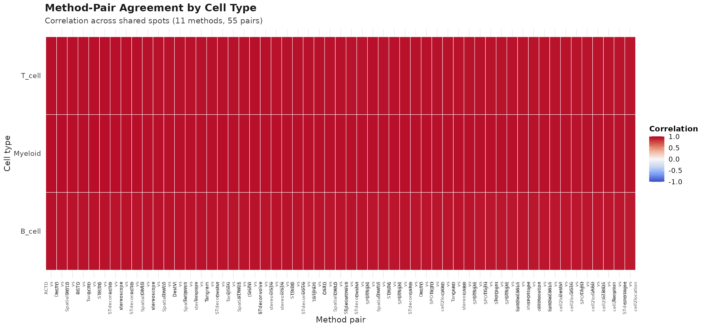
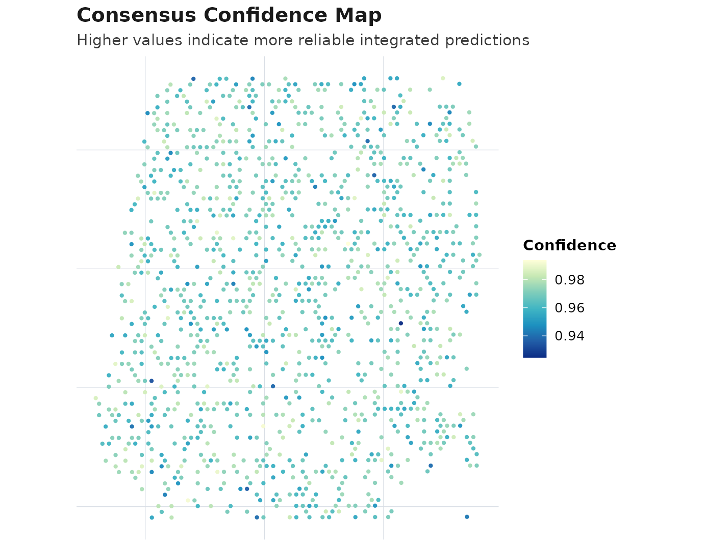
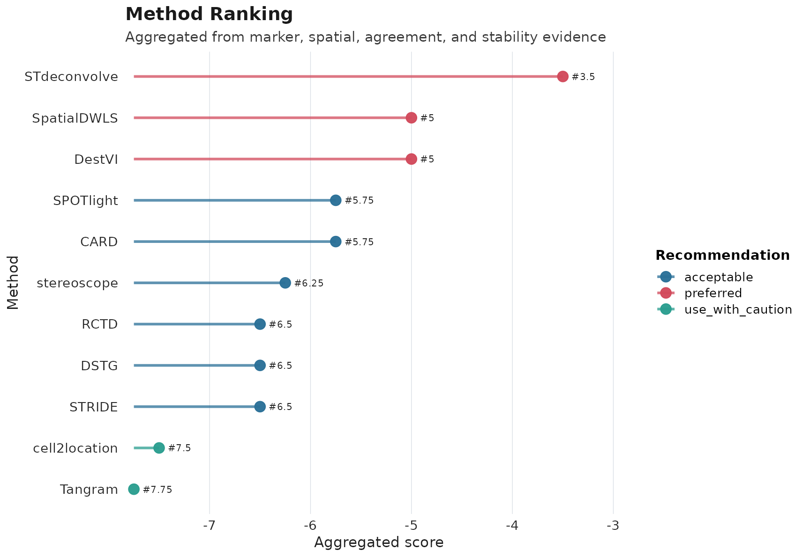
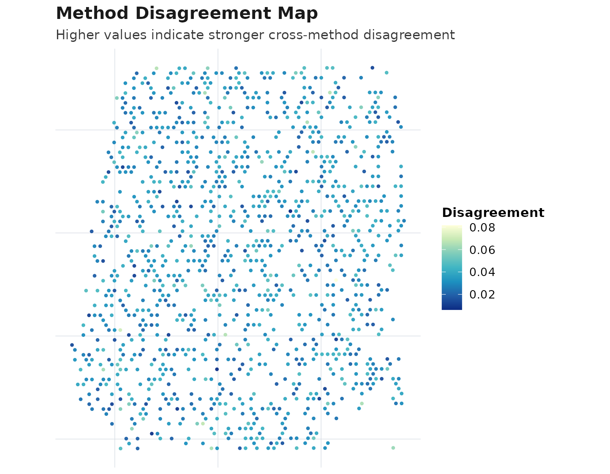

# AEGIS One-Step Deconvolution Workflow

## 1) What one-step deconvolution means in AEGIS

AEGIS supports three method support modes: - `run_and_import_r`:
runnable directly in R - `run_and_import_python`: runnable through
Python (optional) - `import_only`: import exported outputs only

Use the registry first:

``` r
registry <- get_supported_methods()
knitr::kable(registry)
```

| method_name   | support_mode          | can_run_in_r | can_run_in_python | requires_reference | requires_spatial_coords | expected_output_type | adapter_reader     | reader_function    | runner_function   | dependency_type | backend_dependency | notes                                                                                    |
|:--------------|:----------------------|:-------------|:------------------|:-------------------|:------------------------|:---------------------|:-------------------|:-------------------|:------------------|:----------------|:-------------------|:-----------------------------------------------------------------------------------------|
| RCTD          | run_and_import_r      | TRUE         | FALSE             | TRUE               | TRUE                    | proportion           | read_rctd          | read_rctd          | run_rctd          | r_package       | spacexr            | R-native runner; prefers spacexr pipeline when available.                                |
| SPOTlight     | run_and_import_r      | TRUE         | FALSE             | TRUE               | TRUE                    | proportion           | read_spotlight     | read_spotlight     | run_spotlight     | r_package       | SPOTlight          | R-native runner; requires SPOTlight package and suitable reference inputs.               |
| cell2location | run_and_import_python | FALSE        | TRUE              | TRUE               | TRUE                    | abundance            | read_cell2location | read_cell2location | run_cell2location | python_module   | cell2location,scvi | Python via reticulate; if unavailable, import exported tables with read_cell2location(). |
| CARD          | run_and_import_r      | TRUE         | FALSE             | TRUE               | TRUE                    | proportion           | read_card          | read_card          | run_card          | r_package       | CARD               | R-native runner; requires CARD package and suitable reference inputs.                    |
| SpatialDWLS   | import_only           | FALSE        | FALSE             | FALSE              | FALSE                   | proportion           | read_spatialdwls   | read_spatialdwls   | NA                | import_only     | NA                 | Import-only in P9. Use read_spatialdwls().                                               |
| stereoscope   | run_and_import_python | FALSE        | TRUE              | TRUE               | TRUE                    | proportion           | read_stereoscope   | read_stereoscope   | run_stereoscope   | python_module   | scvi               | Python via reticulate (experimental wrapper).                                            |
| DestVI        | run_and_import_python | FALSE        | TRUE              | TRUE               | TRUE                    | abundance            | read_destvi        | read_destvi        | run_destvi        | python_module   | scvi               | Python via reticulate (experimental wrapper).                                            |
| Tangram       | run_and_import_python | FALSE        | TRUE              | TRUE               | TRUE                    | mapping              | read_tangram       | read_tangram       | run_tangram       | python_module   | tangram            | Python via reticulate (experimental wrapper).                                            |
| STdeconvolve  | import_only           | FALSE        | FALSE             | FALSE              | FALSE                   | latent               | read_stdeconvolve  | read_stdeconvolve  | NA                | import_only     | NA                 | Import-only in P9. Use read_stdeconvolve().                                              |
| DSTG          | import_only           | FALSE        | FALSE             | FALSE              | FALSE                   | proportion           | read_dstg          | read_dstg          | NA                | import_only     | NA                 | Import-only in P9. Use read_dstg().                                                      |
| STRIDE        | import_only           | FALSE        | FALSE             | FALSE              | FALSE                   | proportion           | read_stride        | read_stride        | NA                | import_only     | NA                 | Import-only in P9. Use read_stride().                                                    |

## 2) Load spatial data and markers

``` r
data("aegis_example", package = "AEGIS")
seu <- aegis_example
markers <- readRDS(system.file("extdata", "marker_list.rds", package = "AEGIS"))
```

## 3) Prepare a reference object

In practice this should be your real single-cell reference object.

``` r
reference <- matrix(
  c(4, 2, 1, 2, 5, 2, 1, 2, 6),
  nrow = 3,
  byrow = TRUE
)
rownames(reference) <- c("B_cell", "T_cell", "Myeloid")
colnames(reference) <- c("g1", "g2", "g3")
```

## 4) Run one method (direct execution)

``` r
res_one <- run_deconvolution(
  seu = seu,
  reference = reference,
  methods = "SPOTlight",
  strict = TRUE
)

obj_one <- run_aegis(res_one$seu, deconv = res_one$deconv, markers = markers)
```

## 5) Run multiple methods in one step

``` r
res_multi <- run_deconvolution(
  seu = seu,
  reference = reference,
  methods = c("SPOTlight", "CARD", "RCTD"),
  strict = FALSE
)

obj_multi <- run_aegis(res_multi$seu, deconv = res_multi$deconv, markers = markers)
```

## 6) Full one-step wrapper

``` r
obj_full <- run_aegis_full(
  seu = seu,
  reference = reference,
  methods = c("SPOTlight", "CARD", "RCTD"),
  markers = markers,
  strict = FALSE
)
```

## 7) Optional Python-backed methods

Python-backed methods are optional. If Python modules are missing: -
strict mode: clear error - non-strict mode: method is skipped with a
message

``` r
res_py <- run_deconvolution(
  seu = seu,
  reference = reference,
  methods = c("cell2location", "DestVI", "Tangram"),
  use_python = TRUE,
  strict = FALSE
)
```

## 8) Downstream AEGIS analysis and visualization

For a fully reproducible vignette run (without backend dependencies),
this chunk uses simulated deconvolution and then runs the same
downstream pipeline.

``` r
demo_methods <- registry$method_name
deconv_demo <- simulate_deconv_results(
  seu,
  methods = demo_methods,
  cell_types = c("B_cell", "T_cell", "Myeloid"),
  seed = 909
)
#> Loading required namespace: SeuratObject

obj <- run_aegis(seu, deconv = deconv_demo, markers = markers)
obj <- score_methods(obj)
obj <- rank_methods(obj, method = "mean_rank")
obj <- compute_consensus(obj, strategy = "weighted", top_n = min(4, length(demo_methods)))

obj$consensus$result$methods_used
#> [1] "STdeconvolve" "SpatialDWLS"  "DestVI"       "SPOTlight"
```

``` r
plot_compare(obj, type = "heatmap")
```



``` r
plot_compare(obj, type = "consensus_map")
```



``` r
plot_compare(obj, type = "ranking")
```



``` r
plot_compare(obj, type = "disagreement_map")
```



``` r
plot_compare(obj, type = "confidence_map")
```


## 9) Practical notes

1.  Use direct execution when method dependencies and inputs are ready.
2.  Use importer functions (`read_*`) when methods are not executable in
    your environment.
3.  Treat Python-backed methods as optional unless you manage a
    validated Python environment.
4.  Use
    [`run_aegis_full()`](https://jameswu7.github.io/AEGIS/reference/run_deconvolution.md)
    for one-step execution plus downstream AEGIS analysis.
