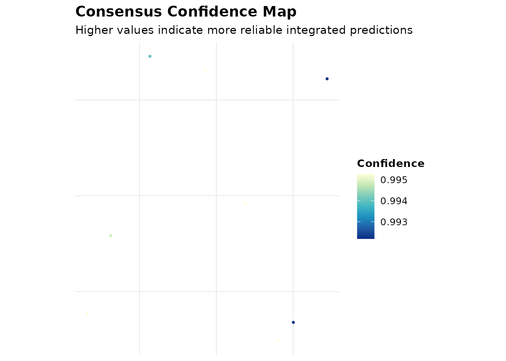
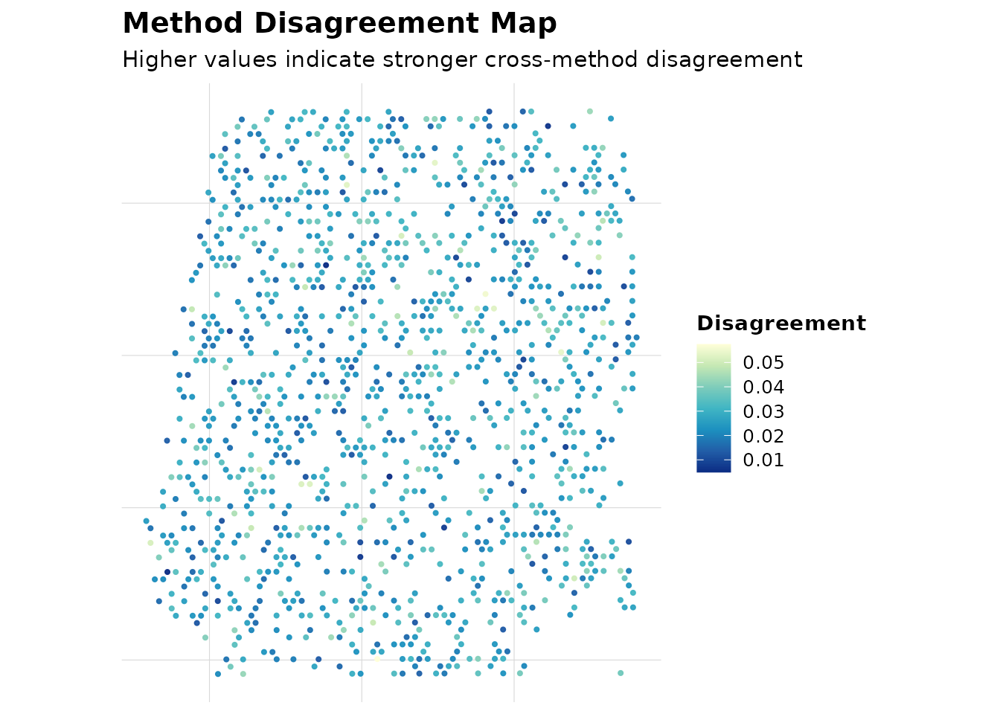
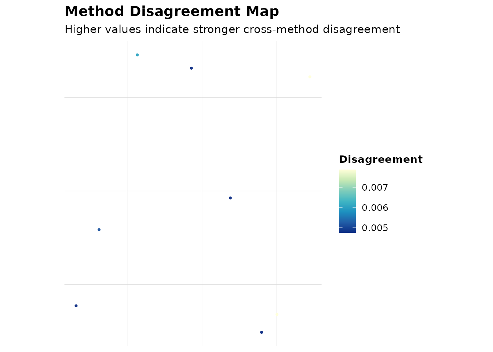

# AEGIS One-Step Deconvolution Workflow

This tutorial demonstrates one-step method dispatch and downstream AEGIS analysis.

## Step 1. Method registry and dispatch

```r
registry <- get_supported_methods()
res <- run_deconvolution(
  seu = seu,
  reference = reference,
  methods = c("SPOTlight", "CARD", "RCTD"),
  strict = FALSE
)
all_methods <- registry$method_name
deconv_demo <- simulate_deconv_results(
  seu,
  methods = all_methods,
  cell_types = c("B_cell", "T_cell", "Myeloid"),
  seed = 909
)
obj <- run_aegis(seu, deconv = deconv_demo, markers = markers)
obj <- score_methods(obj)
obj <- rank_methods(obj, method = "mean_rank")
obj <- compute_consensus(obj, strategy = "weighted", top_n = min(4, length(all_methods)))
```

## Step 2. Visualization

```r
plot_compare(obj, type = "heatmap")
```


Heatmap uses all supported methods (11 methods / 55 pairs); dense x-axis pair labels are omitted in this static preview to keep text readable.

```r
plot_compare(obj, type = "consensus_map")
```



```r
plot_compare(obj, type = "ranking")
```


```r
plot_compare(obj, type = "disagreement_map")
```



```r
plot_compare(obj, type = "confidence_map")
```



## Practical notes

- Use R-native runnable methods first.
- If a method is not executable in your environment, use `read_*()` import adapters.
- Keep `plot_compare()` as the primary visualization entry.
