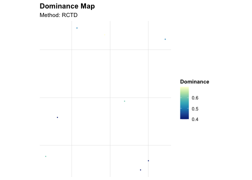

## 1. Load Example Seurat Object


``` r
data("aegis_example", package = "AEGIS")
seu <- aegis_example
```

## 2. Simulated Workflow (Development Path)


``` r
markers <- readRDS(system.file("extdata", "marker_list.rds", package = "AEGIS"))
deconv_sim <- simulate_deconv_results(
  seu,
  methods = c("RCTD", "SPOTlight", "cell2location"),
  seed = 2026
)

obj_sim <- run_aegis(seu, deconv = deconv_sim, markers = markers)
obj_sim <- score_methods(obj_sim)
obj_sim <- rank_methods(obj_sim, method = "mean_rank")
obj_sim <- compute_consensus(obj_sim, strategy = "weighted", top_n = 2)
```


``` r
knitr::kable(obj_sim$audit$basic$summary)
```


|method        | n_spots| n_celltypes| zero_fraction| near_zero_fraction| mean_dominance| mean_entropy| mean_n_detected_types| mean_sum_dev|
|:-------------|-------:|-----------:|-------------:|------------------:|--------------:|------------:|---------------------:|------------:|
|RCTD          |    1200|           7|     0.1015476|          0.2575000|      0.3695554|     1.557445|              5.197500|            0|
|SPOTlight     |    1200|           7|     0.0410714|          0.1664286|      0.3073309|     1.702981|              5.835000|            0|
|cell2location |    1200|           7|     0.0896429|          0.2244048|      0.3407826|     1.617544|              5.429167|            0|


``` r
rank_cols <- intersect(
  c("method", "overall_rank", "overall_score", "recommendation"),
  colnames(obj_sim$consensus$method_ranking)
)
knitr::kable(obj_sim$consensus$method_ranking[, rank_cols, drop = FALSE], digits = 3)
```


|   |method        | overall_rank| overall_score|recommendation |
|:--|:-------------|------------:|-------------:|:--------------|
|2  |SPOTlight     |          1.5|          -1.5|preferred      |
|1  |RCTD          |          2.0|          -2.0|acceptable     |
|3  |cell2location |          2.5|          -2.5|acceptable     |


``` r
plot_audit(obj_sim, type = "entropy", method = "SPOTlight")
```


``` r
plot_compare(obj_sim, type = "heatmap")
```


``` r
plot_method_ranking(obj_sim)
```


``` r
plot_disagreement_map(obj_sim)
```


``` r
plot_consensus_confidence(obj_sim)
```


## 3. Real Import Workflow (Adapter Path)

This section mimics exported backend result files and imports them using AEGIS adapter readers.


``` r
spots <- colnames(seu)[1:8]
seu_small <- suppressWarnings(seu[, spots])
```

### 3.1 Build Example Exported Files


``` r
tmp_rctd <- tempfile(fileext = ".csv")
utils::write.csv(
  data.frame(
    barcode = spots,
    B_cell = c(0.5, 0.2, 0.4, 0.3, 0.1, 0.2, 0.4, 0.5),
    T_cell = c(0.3, 0.6, 0.4, 0.4, 0.7, 0.6, 0.3, 0.3),
    Myeloid = c(0.2, 0.2, 0.2, 0.3, 0.2, 0.2, 0.3, 0.2),
    check.names = FALSE
  ),
  tmp_rctd,
  row.names = FALSE
)

tmp_spotlight <- tempfile(fileext = ".tsv")
utils::write.table(
  data.frame(
    spot_id = spots,
    B_cell = c(0.4, 0.3, 0.5, 0.3, 0.2, 0.3, 0.4, 0.4),
    T_cell = c(0.4, 0.5, 0.3, 0.4, 0.6, 0.5, 0.4, 0.3),
    Myeloid = c(0.2, 0.2, 0.2, 0.3, 0.2, 0.2, 0.2, 0.3),
    sample = "S1",
    check.names = FALSE
  ),
  tmp_spotlight,
  sep = "\t",
  quote = FALSE,
  row.names = FALSE
)

tmp_cell2location <- tempfile(fileext = ".csv")
utils::write.csv(
  data.frame(
    spot = spots,
    B_cell = c(15, 8, 12, 10, 5, 7, 9, 11),
    T_cell = c(12, 18, 10, 13, 20, 16, 12, 10),
    Myeloid = c(5, 6, 4, 8, 5, 7, 6, 9),
    x = seq_along(spots),
    y = rev(seq_along(spots)),
    check.names = FALSE
  ),
  tmp_cell2location,
  row.names = FALSE
)
```

### 3.2 Import and Standardize


``` r
rctd <- read_rctd(tmp_rctd)
spotlight <- read_spotlight(tmp_spotlight)
cell2location <- read_cell2location(tmp_cell2location)
#> Warning: cell2location: dropped likely metadata numeric columns: x, y
```

### 3.3 Build AEGIS Object from Real Inputs


``` r
obj_real <- run_aegis(
  seu_small,
  deconv = list(
    RCTD = rctd,
    SPOTlight = spotlight,
    cell2location = cell2location
  ),
  do_marker = FALSE,
  do_spatial = FALSE
)
```


``` r
knitr::kable(obj_real$audit$basic$summary)
```


|method        | n_spots| n_celltypes| zero_fraction| near_zero_fraction| mean_dominance| mean_entropy| mean_n_detected_types| mean_sum_dev|
|:-------------|-------:|-----------:|-------------:|------------------:|--------------:|------------:|---------------------:|------------:|
|RCTD          |       8|           3|             0|                  0|      0.5125000|    0.9992982|                     3|            0|
|SPOTlight     |       8|           3|             0|                  0|      0.4625000|    1.0408587|                     3|            0|
|cell2location |       8|           3|             0|                  0|      0.4904068|    1.0158112|                     3|            0|


``` r
plot_audit(obj_real, type = "dominance", method = "RCTD")
```



### 3.4 Additional Import Adapters (same standardized output shape)


``` r
tmp_card <- tempfile(fileext = ".csv")
utils::write.csv(
  data.frame(
    spot_id = spots,
    B_cell = c(0.55, 0.25, 0.45, 0.35, 0.15, 0.25, 0.35, 0.45),
    T_cell = c(0.30, 0.55, 0.35, 0.40, 0.65, 0.55, 0.45, 0.35),
    Myeloid = c(0.15, 0.20, 0.20, 0.25, 0.20, 0.20, 0.20, 0.20),
    check.names = FALSE
  ),
  tmp_card,
  row.names = FALSE
)

tmp_destvi <- tempfile(fileext = ".csv")
utils::write.csv(
  data.frame(
    barcode = spots,
    B_cell = c(20, 8, 12, 9, 5, 7, 8, 10),
    T_cell = c(10, 18, 11, 13, 20, 17, 12, 9),
    Myeloid = c(4, 6, 5, 7, 4, 6, 5, 8),
    check.names = FALSE
  ),
  tmp_destvi,
  row.names = FALSE
)

tmp_stdec <- tempfile(fileext = ".csv")
utils::write.csv(
  data.frame(
    spot = spots,
    topic1 = c(0.6, 0.3, 0.4, 0.5, 0.2, 0.3, 0.4, 0.5),
    topic2 = c(0.4, 0.7, 0.6, 0.5, 0.8, 0.7, 0.6, 0.5),
    check.names = FALSE
  ),
  tmp_stdec,
  row.names = FALSE
)

card <- read_card(tmp_card)
destvi <- read_destvi(tmp_destvi)
stdec <- read_stdeconvolve(tmp_stdec)

obj_extra <- as_aegis(
  seu_small,
  deconv = list(CARD = card, DestVI = destvi, STdeconvolve = stdec)
)
obj_extra <- audit_basic(obj_extra)
knitr::kable(obj_extra$audit$basic$summary)
```


|method       | n_spots| n_celltypes| zero_fraction| near_zero_fraction| mean_dominance| mean_entropy| mean_n_detected_types| mean_sum_dev|
|:------------|-------:|-----------:|-------------:|------------------:|--------------:|------------:|---------------------:|------------:|
|CARD         |       8|           3|             0|                  0|      0.5062500|    1.0102583|                     3|            0|
|DestVI       |       8|           3|             0|                  0|      0.5167843|    0.9951021|                     3|            0|
|STdeconvolve |       8|           2|             0|                  0|      0.6250000|    0.6409325|                     2|            0|


### 3.5 Remaining P8 Adapters + Generic Importer


``` r
tmp_spatialdwls <- tempfile(fileext = ".tsv")
utils::write.table(
  data.frame(
    barcode = spots,
    B_cell = c(0.50, 0.25, 0.40, 0.35, 0.10, 0.20, 0.35, 0.45),
    T_cell = c(0.30, 0.55, 0.35, 0.40, 0.70, 0.60, 0.45, 0.35),
    Myeloid = c(0.20, 0.20, 0.25, 0.25, 0.20, 0.20, 0.20, 0.20),
    sample = "S1",
    check.names = FALSE
  ),
  tmp_spatialdwls,
  sep = "\t",
  quote = FALSE,
  row.names = FALSE
)

tmp_stereoscope <- tempfile(fileext = ".csv")
utils::write.csv(
  data.frame(
    spot_id = spots,
    B_cell = c(0.48, 0.22, 0.38, 0.32, 0.12, 0.22, 0.32, 0.42),
    T_cell = c(0.32, 0.58, 0.37, 0.43, 0.68, 0.58, 0.48, 0.36),
    Myeloid = c(0.20, 0.20, 0.25, 0.25, 0.20, 0.20, 0.20, 0.22),
    check.names = FALSE
  ),
  tmp_stereoscope,
  row.names = FALSE
)

tmp_tangram <- tempfile(fileext = ".tsv")
utils::write.table(
  data.frame(
    cell_id = spots,
    B_cell = c(0.52, 0.24, 0.42, 0.34, 0.14, 0.24, 0.34, 0.46),
    T_cell = c(0.28, 0.56, 0.34, 0.42, 0.66, 0.56, 0.46, 0.34),
    Myeloid = c(0.20, 0.20, 0.24, 0.24, 0.20, 0.20, 0.20, 0.20),
    check.names = FALSE
  ),
  tmp_tangram,
  sep = "\t",
  quote = FALSE,
  row.names = FALSE
)

tmp_dstg <- tempfile(fileext = ".csv")
utils::write.csv(
  data.frame(
    barcode = spots,
    B_cell = c(0.46, 0.21, 0.36, 0.31, 0.11, 0.21, 0.31, 0.40),
    T_cell = c(0.34, 0.59, 0.39, 0.44, 0.69, 0.59, 0.49, 0.38),
    Myeloid = c(0.20, 0.20, 0.25, 0.25, 0.20, 0.20, 0.20, 0.22),
    check.names = FALSE
  ),
  tmp_dstg,
  row.names = FALSE
)

tmp_stride <- tempfile(fileext = ".csv")
utils::write.csv(
  data.frame(
    spot = spots,
    B_cell = c(0.47, 0.23, 0.39, 0.33, 0.13, 0.23, 0.33, 0.43),
    T_cell = c(0.33, 0.57, 0.36, 0.43, 0.67, 0.57, 0.47, 0.35),
    Myeloid = c(0.20, 0.20, 0.25, 0.24, 0.20, 0.20, 0.20, 0.22),
    confidence = c(0.9, 0.88, 0.87, 0.89, 0.91, 0.86, 0.88, 0.90),
    check.names = FALSE
  ),
  tmp_stride,
  row.names = FALSE
)

spatialdwls <- read_spatialdwls(tmp_spatialdwls)
stereoscope <- read_stereoscope(tmp_stereoscope)
tangram <- read_tangram(tmp_tangram)
dstg <- read_dstg(tmp_dstg)
stride <- read_stride(tmp_stride)
#> Warning: STRIDE: dropped likely metadata numeric columns: confidence

generic <- read_deconv_table(tmp_stereoscope, method = "generic")

adapter_overview <- data.frame(
  method = c("SpatialDWLS", "stereoscope", "Tangram", "DSTG", "STRIDE", "generic"),
  n_spots = c(
    nrow(spatialdwls), nrow(stereoscope), nrow(tangram),
    nrow(dstg), nrow(stride), nrow(generic)
  ),
  n_celltypes = c(
    ncol(spatialdwls), ncol(stereoscope), ncol(tangram),
    ncol(dstg), ncol(stride), ncol(generic)
  ),
  row_sum_mean = c(
    mean(rowSums(spatialdwls)), mean(rowSums(stereoscope)), mean(rowSums(tangram)),
    mean(rowSums(dstg)), mean(rowSums(stride)), mean(rowSums(generic))
  )
)
knitr::kable(adapter_overview, digits = 3)
```


|method      | n_spots| n_celltypes| row_sum_mean|
|:-----------|-------:|-----------:|------------:|
|SpatialDWLS |       8|           3|            1|
|stereoscope |       8|           3|            1|
|Tangram     |       8|           3|            1|
|DSTG        |       8|           3|            1|
|STRIDE      |       8|           3|            1|
|generic     |       8|           3|            1|


## 4. Multi-sample Workflow (P6)


``` r
spots_all <- colnames(seu)
n_half <- floor(length(spots_all) / 2)

seu_list <- list(
  sample1 = suppressWarnings(seu[, spots_all[seq_len(n_half)]]),
  sample2 = suppressWarnings(seu[, spots_all[seq.int(n_half + 1L, length(spots_all))]])
)

deconv_nested <- list(
  sample1 = simulate_deconv_results(seu_list$sample1, methods = c("RCTD", "SPOTlight"), seed = 333),
  sample2 = simulate_deconv_results(seu_list$sample2, methods = c("RCTD", "SPOTlight"), seed = 444)
)

obj_multi <- run_aegis(
  seu_list,
  deconv = deconv_nested,
  markers = markers
)

sample_summary <- summarize_by_sample(obj_multi)
knitr::kable(sample_summary)
```


|sample_id | n_spots|method    |methods_available | mean_dominance| mean_entropy| mean_local_inconsistency| mean_spot_agreement| mean_consensus_confidence|
|:---------|-------:|:---------|:-----------------|--------------:|------------:|------------------------:|-------------------:|-------------------------:|
|sample1   |     600|RCTD      |RCTD;SPOTlight    |      0.3709512|     1.553806|                0.0951720|           0.9736282|                 0.9631498|
|sample1   |     600|SPOTlight |RCTD;SPOTlight    |      0.3076496|     1.707738|                0.0726369|           0.9736282|                 0.9631498|
|sample2   |     600|RCTD      |RCTD;SPOTlight    |      0.3767248|     1.546486|                0.0933078|           0.9737247|                 0.9632824|
|sample2   |     600|SPOTlight |RCTD;SPOTlight    |      0.3146903|     1.688583|                0.0737592|           0.9737247|                 0.9632824|


``` r
render_report_batch(obj_multi, output_dir = "reports")
```

## 5. Optional Report Generation


``` r
render_report(obj_sim, output_file = "aegis_report.html")
```

## 6. Summary

- Use `simulate_deconv_results()` for reproducible demos and method development.
- Use method adapters (`read_rctd()`, `read_spotlight()`, `read_cell2location()`, `read_card()`, `read_spatialdwls()`, `read_stereoscope()`, `read_destvi()`, `read_tangram()`, `read_stdeconvolve()`, `read_dstg()`, `read_stride()`) or `read_deconv_table()` for external exports.
- Use `run_aegis()` as the unified pipeline entry for single-sample and multi-sample analysis.
- Use `score_methods()` and `rank_methods()` before weighted integration when method quality differs.
- Use `compute_consensus(strategy = "weighted")` plus disagreement/confidence maps for integration diagnostics.
- Use `summarize_by_sample()` and `render_report_batch()` for multi-sample projects.
