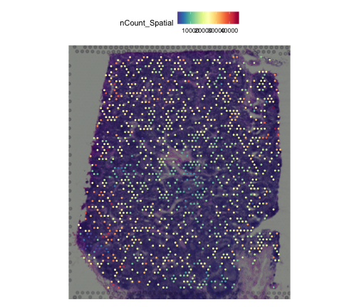

## Demo Data Source

This tutorial uses the built-in Human Lymph Node example object (`aegis_example`) so it can run in CI and pkgdown builds.


``` r
data("aegis_example", package = "AEGIS")
seu <- aegis_example
seu
#> An object of class Seurat 
#> 36601 features across 1200 samples within 1 assay 
#> Active assay: Spatial (36601 features, 0 variable features)
#>  2 layers present: counts, data
#>  1 spatial field of view present: slice1
```

## Optional: Load from Authoritative Raw Files

If you are in repository root and have the authoritative raw files:

- `V1_Human_Lymph_Node_filtered_feature_bc_matrix.h5`
- `V1_Human_Lymph_Node_spatial.tar.gz`
- `V1_Human_Lymph_Node_metrics_summary.csv`

you can load directly with:


``` r
seu <- load_10x_lymphnode(data_dir = ".")
```

## Tissue Context


``` r
safe_tissue_context_plot(seu)
```



## End-to-End AEGIS Workflow (Simulated Inputs)


``` r
markers <- readRDS(system.file("extdata", "marker_list.rds", package = "AEGIS"))
deconv <- simulate_deconv_results(seu, seed = 2026)

obj <- run_aegis(seu, deconv = deconv, markers = markers)
obj <- score_methods(obj)
obj <- rank_methods(obj, method = "mean_rank")
obj <- compute_consensus(obj, strategy = "weighted", top_n = 2)
```


``` r
knitr::kable(obj$audit$basic$summary)
```


|method        | n_spots| n_celltypes| zero_fraction| near_zero_fraction| mean_dominance| mean_entropy| mean_n_detected_types| mean_sum_dev|
|:-------------|-------:|-----------:|-------------:|------------------:|--------------:|------------:|---------------------:|------------:|
|RCTD          |    1200|           7|     0.1015476|          0.2575000|      0.3695554|     1.557445|              5.197500|            0|
|SPOTlight     |    1200|           7|     0.0410714|          0.1664286|      0.3073309|     1.702981|              5.835000|            0|
|cell2location |    1200|           7|     0.0896429|          0.2244048|      0.3407826|     1.617544|              5.429167|            0|


``` r
rank_cols <- intersect(
  c("method", "overall_rank", "overall_score", "recommendation"),
  colnames(obj$consensus$method_ranking)
)
knitr::kable(obj$consensus$method_ranking[, rank_cols, drop = FALSE], digits = 3)
```


|   |method        | overall_rank| overall_score|recommendation |
|:--|:-------------|------------:|-------------:|:--------------|
|2  |SPOTlight     |          1.5|          -1.5|preferred      |
|1  |RCTD          |          2.0|          -2.0|acceptable     |
|3  |cell2location |          2.5|          -2.5|acceptable     |


## Example Plots


``` r
plot_audit(obj, type = "dominance", method = "RCTD")
```


``` r
plot_compare(obj, type = "heatmap")
```


``` r
plot_method_ranking(obj)
```


``` r
plot_consensus_confidence(obj)
```


## Multi-sample Example (Two Sections from the Demo Object)


``` r
spots_all <- colnames(seu)
n_half <- floor(length(spots_all) / 2)

seu_list <- list(
  section_A = suppressWarnings(seu[, spots_all[seq_len(n_half)]]),
  section_B = suppressWarnings(seu[, spots_all[seq.int(n_half + 1L, length(spots_all))]])
)

deconv_nested <- list(
  section_A = simulate_deconv_results(seu_list$section_A, methods = c("RCTD", "SPOTlight"), seed = 91),
  section_B = simulate_deconv_results(seu_list$section_B, methods = c("RCTD", "SPOTlight"), seed = 92)
)

obj_multi <- run_aegis(seu_list, deconv = deconv_nested, markers = markers)
knitr::kable(summarize_by_sample(obj_multi))
```


|sample_id | n_spots|method    |methods_available | mean_dominance| mean_entropy| mean_local_inconsistency| mean_spot_agreement| mean_consensus_confidence|
|:---------|-------:|:---------|:-----------------|--------------:|------------:|------------------------:|-------------------:|-------------------------:|
|section_A |     600|RCTD      |RCTD;SPOTlight    |      0.3722973|     1.543771|                0.0958448|           0.9736577|                 0.9631872|
|section_A |     600|SPOTlight |RCTD;SPOTlight    |      0.3078233|     1.701391|                0.0722292|           0.9736577|                 0.9631872|
|section_B |     600|RCTD      |RCTD;SPOTlight    |      0.3762560|     1.543987|                0.0958485|           0.9736896|                 0.9632311|
|section_B |     600|SPOTlight |RCTD;SPOTlight    |      0.3108974|     1.698998|                0.0734852|           0.9736896|                 0.9632311|


## Notes

- AEGIS can run with simulated outputs or imported real exported tables.
- AEGIS does not execute external deconvolution methods.
- Multi-sample projects can use `run_aegis()` + `summarize_by_sample()` + `render_report_batch()`.
