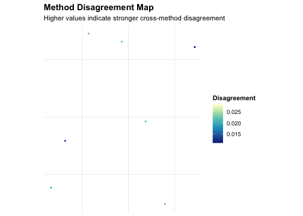
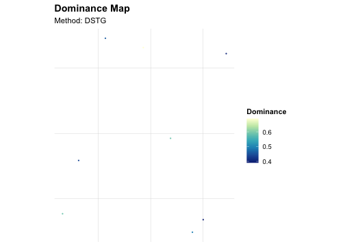

## Step 1. Load data and markers


``` r
data("aegis_example", package = "AEGIS")
seu <- aegis_example
markers <- aegis_default_markers()
```

## Step 2. Simulate deconvolution outputs


``` r
deconv <- simulate_deconv_results(
  seu,
  methods = c("RCTD", "SPOTlight", "cell2location"),
  seed = 2026
)
```

## Step 3. Run the core pipeline


``` r
obj <- run_aegis(seu, deconv = deconv, markers = markers)
```

## Step 4. Score and rank methods (RRA + mean-rank)


``` r
obj <- score_methods(obj)
obj_rra <- rank_methods(obj, method = "rra")
#> Warning: RRA aggregation unavailable (missing RobustRankAggreg or failed
#> aggregation); falling back to mean_rank.
obj_meta <- rank_methods(obj, method = "mean_rank")

rra_cols <- intersect(
  c("method", "overall_rank", "overall_score", "rra_pvalue", "aggregation_used", "recommendation"),
  colnames(obj_rra$consensus$method_ranking)
)
meta_cols <- intersect(
  c("method", "overall_rank", "overall_score", "aggregation_used", "recommendation"),
  colnames(obj_meta$consensus$method_ranking)
)

knitr::kable(obj_rra$consensus$method_ranking[, rra_cols, drop = FALSE], digits = 4)
```


|   |method        | overall_rank| overall_score| rra_pvalue|aggregation_used   |recommendation |
|:--|:-------------|------------:|-------------:|----------:|:------------------|:--------------|
|2  |SPOTlight     |          1.5|          -1.5|         NA|mean_rank_fallback |preferred      |
|1  |RCTD          |          2.0|          -2.0|         NA|mean_rank_fallback |acceptable     |
|3  |cell2location |          2.5|          -2.5|         NA|mean_rank_fallback |acceptable     |


``` r
knitr::kable(obj_meta$consensus$method_ranking[, meta_cols, drop = FALSE], digits = 4)
```


|   |method        | overall_rank| overall_score|aggregation_used |recommendation |
|:--|:-------------|------------:|-------------:|:----------------|:--------------|
|2  |SPOTlight     |          1.5|          -1.5|mean_rank        |preferred      |
|1  |RCTD          |          2.0|          -2.0|mean_rank        |acceptable     |
|3  |cell2location |          2.5|          -2.5|mean_rank        |acceptable     |


``` r

best_method <- obj_meta$consensus$method_ranking$method[[1]]
best_method
#> [1] "SPOTlight"
```

## Step 5. Build weighted consensus from top-ranked methods


``` r
obj_meta <- compute_consensus(obj_meta, strategy = "weighted", top_n = 2)
obj_meta$consensus$result$methods_used
#> [1] "SPOTlight" "RCTD"
```

## Step 6. Visualize audits and consensus


``` r
plot_audit(obj_meta, type = "dominance", method = best_method)
```


``` r
plot_compare(obj_meta, type = "heatmap")
```


``` r
plot_compare(obj_meta, type = "spot_agreement")
```


``` r
plot_compare(obj_meta, type = "consensus_map")
```


``` r
plot_method_ranking(obj_meta)
```


``` r
plot_disagreement_map(obj_meta)
```




``` r
plot_consensus_confidence(obj_meta)
```



## Step 7. Generate report


``` r
render_report(obj_meta, output_file = "aegis_quick_start_report.html")
```

This quick start shows the minimum workflow from input data to ranking and consensus outputs.
