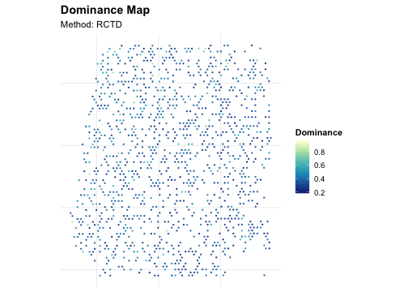
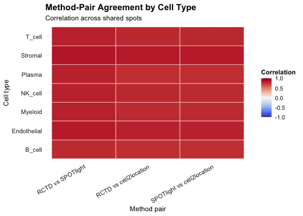
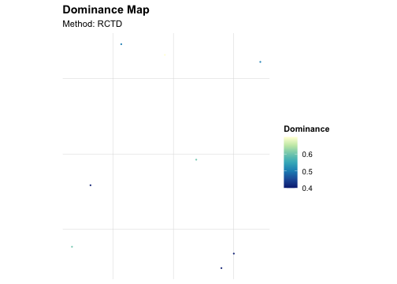
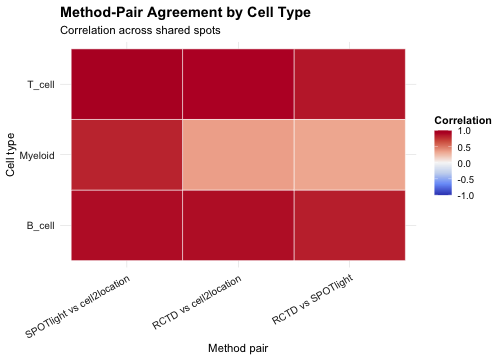

## Step 1. Load data and markers


``` r
data("aegis_example", package = "AEGIS")
seu <- aegis_example
markers <- aegis_default_markers()
```

## Step 2. Simulate deconvolution outputs


``` r
deconv <- simulate_deconv_results(
  seu,
  methods = c("RCTD", "SPOTlight", "cell2location"),
  seed = 2026
)
```

## Step 3. Run the core pipeline


``` r
obj <- run_aegis(seu, deconv = deconv, markers = markers)
```

## Step 4. Score, rank, and integrate methods


``` r
obj <- score_methods(obj)
obj <- rank_methods(obj, method = "mean_rank")
obj <- compute_consensus(obj, strategy = "weighted", top_n = 2)

rank_cols <- intersect(
  c("method", "overall_rank", "overall_score", "recommendation"),
  colnames(obj$consensus$method_ranking)
)
knitr::kable(obj$consensus$method_ranking[, rank_cols, drop = FALSE], digits = 3)
```


|   |method        | overall_rank| overall_score|recommendation |
|:--|:-------------|------------:|-------------:|:--------------|
|2  |SPOTlight     |          1.5|          -1.5|preferred      |
|1  |RCTD          |          2.0|          -2.0|acceptable     |
|3  |cell2location |          2.5|          -2.5|acceptable     |


## Step 5. Visualize audits and consensus


``` r
plot_audit(obj, type = "dominance", method = "RCTD")
```




``` r
plot_compare(obj, type = "heatmap")
```


``` r
plot_method_ranking(obj)
```




``` r
plot_disagreement_map(obj)
```




``` r
plot_consensus_confidence(obj)
```



## Step 6. Generate report


``` r
render_report(obj, output_file = "aegis_quick_start_report.html")
```

This quick start shows the minimum workflow from input data to ranking and consensus outputs.
